# Guide utilisateur — ADIKOM PILOT

**Système interne de gestion et de pilotage**
**ADIKOM TECHNOLOGIE & TRAVEL**

| | |
| --- | --- |
| **Version du guide** | 1.0 |
| **Date** | 6 septembre 2026 |
| **Adresse du système** | https://adikom-pilot.vercel.app |
| **Destinataires** | Collaborateurs et administrateurs autorisés d'ADIKOM |
| **Captures** | Prises sur le système en production, avec le jeu de démonstration |

---

## À qui s'adresse ce guide

Ce guide s'adresse à **toute personne d'ADIKOM appelée à utiliser ADIKOM PILOT**,
qu'elle soit ou non à l'aise avec l'informatique. Il n'exige aucune connaissance
technique.

Il décrit **le système tel qu'il existe aujourd'hui**. Rien de ce qui y figure
n'est une promesse : chaque écran, chaque champ et chaque bouton décrit ici est
présent dans le système. Lorsqu'une partie du produit reste à construire, le
guide le dit explicitement — vous trouverez ces mentions au fil du texte et
rassemblées au **§13**.

### Comment lire ce guide

- Les **§1 à §3** décrivent ce qu'il faut savoir avant de commencer. Lisez-les
  une fois : ils s'appliquent à tous les écrans.
- Les **§4 à §12** décrivent les neuf modules, un par un. Consultez celui qui
  vous concerne.
- Le **§14** déroule des **scénarios complets** de bout en bout. C'est le
  meilleur point d'entrée pour comprendre comment les modules s'articulent.
- Les **§15 et §16** rassemblent le vocabulaire et les blocages courants.

---

## Sommaire

| § | Titre |
| --- | --- |
| 1 | [Se connecter](#1--se-connecter) |
| 2 | [Se repérer dans le système](#2--se-repérer-dans-le-système) |
| 3 | [Sept principes qui valent partout](#3--sept-principes-qui-valent-partout) |
| 4 | [Module 01 — Tableau de bord](#4--module-01--tableau-de-bord) |
| 5 | [Module 02 — Centre de notifications](#5--module-02--centre-de-notifications) |
| 6 | [Module 03 — Projets & Planification](#6--module-03--projets--planification) |
| 7 | [Module 04 — Tiers](#7--module-04--tiers) |
| 8 | [Module 05 — Gestion de location](#8--module-05--gestion-de-location) |
| 9 | [Module 06 — Banques & Caisses](#9--module-06--banques--caisses) |
| 10 | [Module 07 — Facturation & Paiement](#10--module-07--facturation--paiement) |
| 11 | [Module 08 — Utilisateurs & Groupes](#11--module-08--utilisateurs--groupes) |
| 12 | [Module 09 — Paramètres](#12--module-09--paramètres) |
| 13 | [Ce que le système ne fait pas encore](#13--ce-que-le-système-ne-fait-pas-encore) |
| 14 | [Scénarios complets](#14--scénarios-complets) |
| 15 | [Vocabulaire des statuts](#15--vocabulaire-des-statuts) |
| 16 | [Blocages courants et que faire](#16--blocages-courants-et-que-faire) |

---

# 1 — Se connecter

## 1.1 La page d'accueil

Ouvrez votre navigateur à l'adresse **https://adikom-pilot.vercel.app**.

Vous arrivez sur la page d'accueil publique d'ADIKOM PILOT. Cette page ne
contient **aucune donnée d'ADIKOM** : ni client, ni véhicule, ni montant. Elle
présente le système et donne accès à la connexion.

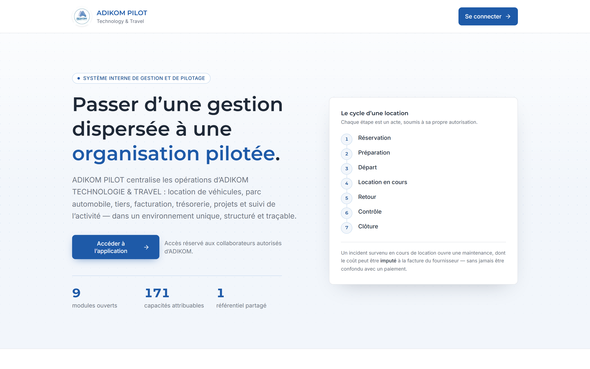

> **Ce qu'il faut observer sur cette capture**
>
> - En haut à gauche, le **logo officiel ADIKOM** sur fond blanc, et le nom
>   « ADIKOM PILOT — Technology & Travel ».
> - En haut à droite, le bouton **« Se connecter »**, présent en permanence
>   quand vous faites défiler la page.
> - Au centre gauche, le bouton principal **« Accéder à l'application »** :
>   il mène au même endroit.
> - À droite, l'encadré **« Le cycle d'une location »** en sept étapes —
>   Réservation, Préparation, Départ, Location en cours, Retour, Contrôle,
>   Clôture. C'est le cœur du système, résumé.
> - En bas, trois chiffres : **9 modules ouverts**, **171 capacités
>   attribuables**, **1 référentiel partagé**.

La page complète, avec toutes ses sections, figure en annexe :
`61_Annexe_Landing_Page_Integrale.png`.

> **Il n'existe aucune inscription.** Aucun client, aucun fournisseur et aucun
> partenaire ne peut créer de compte. ADIKOM PILOT est un système **strictement
> interne** : seuls les collaborateurs d'ADIKOM s'y connectent, et leurs comptes
> sont créés par le Super Admin.

## 1.2 L'écran de connexion

Cliquez sur **« Se connecter »**.

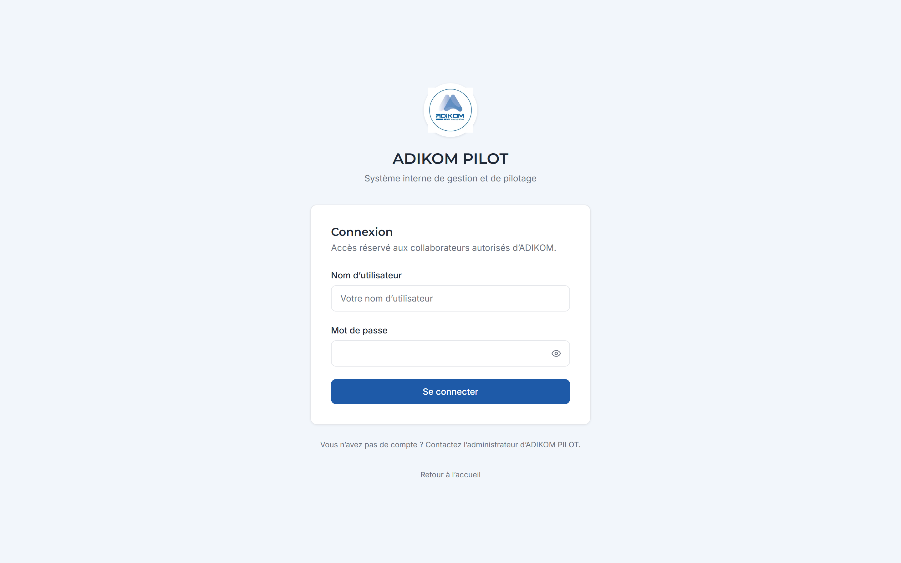

> **Ce qu'il faut observer sur cette capture**
>
> - Le logo officiel, posé sur une zone blanche qui le laisse parfaitement
>   lisible.
> - Deux champs seulement : **Nom d'utilisateur** et **Mot de passe**.
> - La petite **icône en forme d'œil**, à droite du mot de passe : elle affiche
>   ou masque ce que vous tapez. Utile pour vérifier une saisie.
> - La mention **« Accès réservé aux collaborateurs autorisés d'ADIKOM »**.
> - En bas : **« Vous n'avez pas de compte ? Contactez l'administrateur
>   d'ADIKOM PILOT. »** — c'est la seule marche à suivre.

### Marche à suivre

1. Saisissez votre **nom d'utilisateur**. Ce n'est pas votre adresse e-mail :
   c'est un identifiant interne que l'administrateur vous a communiqué
   (par exemple `demo.direction`).
2. Saisissez votre **mot de passe**. Il compte au minimum **8 caractères**.
3. Cliquez sur **« Se connecter »**.

### Ce qui peut se passer ensuite

| Situation | Ce que vous voyez | Que faire |
| --- | --- | --- |
| Connexion réussie | Le **Tableau de bord** s'ouvre | Rien, vous êtes dans le système |
| Identifiant ou mot de passe faux | Un message rouge au-dessus des champs | Vérifiez la saisie ; si le doute persiste, contactez l'administrateur |
| Mot de passe trop court | « Le mot de passe doit contenir au moins 8 caractères. » | Complétez la saisie |
| Première connexion | L'écran **« Changer le mot de passe »** s'ouvre | Choisissez votre mot de passe définitif : c'est obligatoire |
| Compte désactivé ou suspendu | La connexion est refusée | Contactez l'administrateur |

> **Le message d'erreur ne dit jamais lequel des deux champs est faux.** C'est
> volontaire : indiquer « cet identifiant existe, mais le mot de passe est
> faux » renseignerait quelqu'un qui essaie d'entrer.

## 1.3 Le premier mot de passe

Un compte créé par le Super Admin reçoit un **mot de passe temporaire**. À la
première connexion, le système exige de le remplacer avant tout accès aux
modules. Ce n'est pas une formalité : tant que le changement n'est pas fait,
aucun écran métier ne s'ouvre.

Choisissez un mot de passe qui vous est propre, et ne le communiquez à personne
— **toutes vos actions sont journalisées sous votre nom** (voir §11.4).

## 1.4 Se déconnecter

Le bouton **« Se déconnecter »** se trouve tout en bas de la barre latérale,
sous votre nom. Utilisez-le systématiquement sur un poste partagé.

---

# 2 — Se repérer dans le système

## 2.1 La barre latérale

Toutes les pages d'ADIKOM PILOT partagent la même barre latérale, à gauche.
Elle contient la totalité de la navigation.

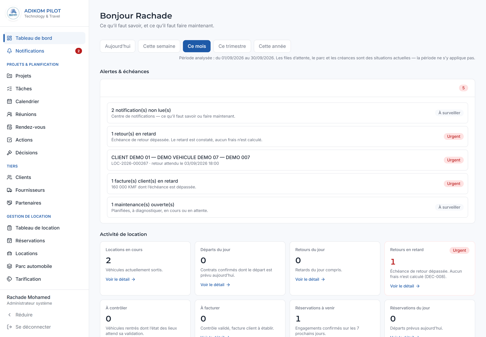

> **Ce qu'il faut observer sur cette capture**
>
> - **En haut de la barre** : le logo ADIKOM et le nom du système.
> - **Deux entrées seules** : *Tableau de bord* et *Notifications*. La pastille
>   rouge à côté de *Notifications* indique le nombre de messages non lus — ici
>   **2**. Elle est visible depuis n'importe quelle page.
> - **Des sections en petites majuscules bleues** : `PROJETS & PLANIFICATION`,
>   `TIERS`, `GESTION DE LOCATION`… Chacune regroupe ses menus.
> - **En bas de la barre** : votre nom, votre fonction, le bouton **« Réduire »**
>   et **« Se déconnecter »**.

### Les neuf modules et leurs menus

| Module | Menus |
| --- | --- |
| **01 — Tableau de bord** | *(entrée unique)* |
| **02 — Notifications** | *(entrée unique)* |
| **03 — Projets & Planification** | Projets · Tâches · Calendrier · Réunions · Rendez-vous · Actions · Décisions |
| **04 — Tiers** | Clients · Fournisseurs · Partenaires |
| **05 — Gestion de location** | Tableau de location · Réservations · Locations · Parc automobile · Tarification · Dommages & Incidents · Maintenance |
| **06 — Banques & Caisses** | Comptes · Écritures · Virement interne |
| **07 — Facturation & Paiement** | Factures clients · Factures fournisseurs · Imputations · Paiements divers |
| **08 — Utilisateurs & Groupes** | Utilisateurs · Groupes · Vue hiérarchique · Journal d'activité |
| **09 — Paramètres** | *(entrée unique, avec des onglets)* |

> **Votre barre latérale n'est pas forcément celle de votre collègue.** Elle
> n'affiche que ce que vous avez le droit de consulter. Si une section entière
> vous est fermée, elle **disparaît** — elle n'apparaît pas grisée. Ne concluez
> donc pas qu'un menu manquant n'existe pas : demandez à l'administrateur.

## 2.2 Réduire la barre latérale

Le bouton **« Réduire »**, en bas de la barre, la replie sur ses seules icônes.
Vous gagnez de la place pour les tableaux larges. Le bouton devient alors une
flèche qui la redéploie.

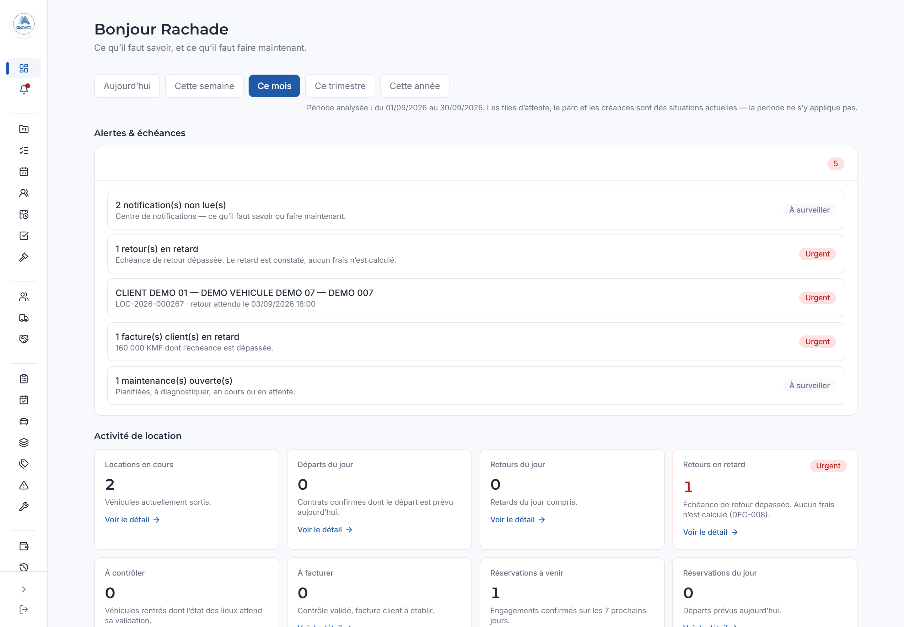

> **Ce qu'il faut observer** : seules les icônes subsistent, et le logo reste
> intact — il n'est ni écrasé ni déformé. Passez la souris sur une icône pour
> lire le nom du menu. Votre choix est mémorisé : vous retrouverez la barre dans
> l'état où vous l'avez laissée.

## 2.3 Sur téléphone et tablette

ADIKOM PILOT fonctionne sur téléphone. L'interface **se réorganise** au lieu de
se réduire : les tableaux deviennent des cartes empilées, les boutons
s'agrandissent pour le doigt, et les en-têtes passent sur plusieurs lignes.

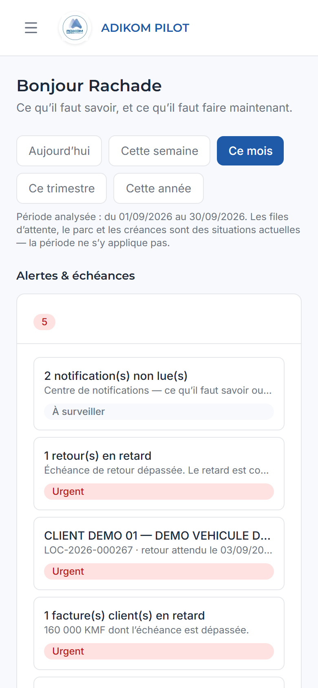

> **Ce qu'il faut observer** : la barre latérale a disparu, remplacée en haut à
> gauche par une **icône à trois traits**. Les indicateurs s'empilent les uns
> sous les autres et restent entièrement lisibles, sans avoir à faire glisser la
> page de côté.

Touchez l'icône à trois traits pour ouvrir la navigation.

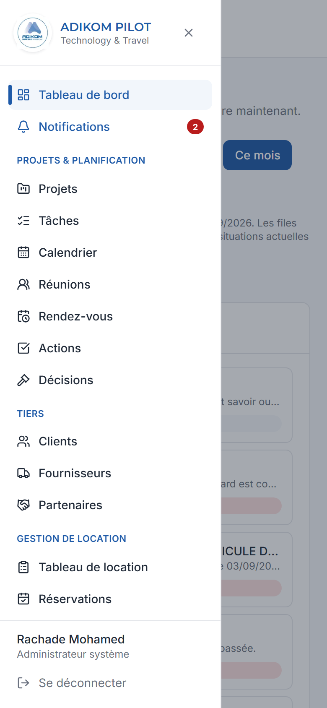

> **Ce qu'il faut observer** : la navigation complète se déploie par-dessus la
> page, avec les mêmes sections et les mêmes menus que sur ordinateur. La croix
> en haut à droite la referme.

Les listes suivent le même principe.

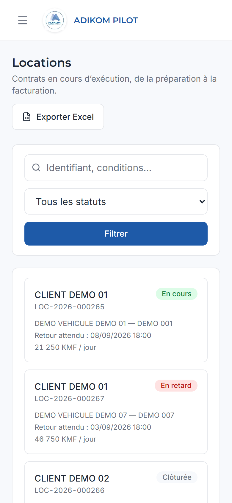

> **Ce qu'il faut observer** : chaque location devient une carte autonome, qui
> porte le client, le véhicule, la période et le statut. Aucune information
> n'est perdue.

## 2.4 Les éléments communs à tous les écrans

Vous retrouverez partout les mêmes repères.

| Élément | Ce que c'est |
| --- | --- |
| **Titre de page** | En haut à gauche, avec une phrase qui dit à quoi sert l'écran |
| **Boutons d'action** | En haut à droite : « Nouveau… », « Exporter Excel »… |
| **Bandeau bleu d'information** | Une règle importante que l'écran vous rappelle |
| **Bandeau jaune d'avertissement** | Une conséquence à mesurer avant d'agir |
| **Barre de filtres** | Recherche, listes déroulantes, dates, puis un bouton **« Filtrer »** |
| **Badges de couleur** | Le statut d'une ligne. Vert = favorable, orange = à surveiller, rouge = urgent, gris = neutre |
| **« Retour à la liste »** | En haut à gauche d'une fiche, pour revenir en arrière |
| **Onglets** | Sur une fiche, pour passer d'une facette à l'autre |

> **Un filtre ne s'applique pas tout seul.** Renseignez vos critères, puis
> cliquez sur **« Filtrer »**. C'est volontaire : sur une liste longue, un
> rechargement à chaque frappe serait pénible.

---

# 3 — Sept principes qui valent partout

Ces sept principes gouvernent l'ensemble du système. Les comprendre une fois
évite la plupart des incompréhensions.

## 3.1 Vous ne voyez que ce que vous avez le droit de voir

Chaque écran, chaque bouton et chaque chiffre dépend d'une **capacité** qui vous
a été attribuée. Le catalogue en compte **171**.

Et surtout : **masquer un bouton n'est pas une protection**. Le système vérifie
vos droits **trois fois** — à l'écran, sur le serveur, puis dans la base de
données. Personne ne peut contourner ses droits en contournant l'interface.

## 3.2 Consulter, exporter, télécharger et imprimer sont quatre droits distincts

C'est la règle la plus structurante du système.

Vous pouvez parfaitement avoir le droit de **consulter** la liste des clients et
de l'**exporter** en tableur, sans avoir celui d'en produire un **PDF** ni de
l'**imprimer**. Aucune de ces capacités n'en implique une autre.

Si un bouton **« Exporter Excel »** ou **« Télécharger le PDF »** manque sur un
écran où vous vous attendiez à le trouver, ce n'est pas une panne : c'est un
droit que vous n'avez pas. Adressez la demande à l'administrateur.

## 3.3 Une donnée ne se supprime pas, elle s'archive

ADIKOM PILOT ne propose **aucune suppression** de donnée métier. Un client, un
véhicule, un fournisseur, un utilisateur devenus inutiles se **désactivent** ou
s'**archivent**.

Conséquence pratique : un élément archivé n'est plus proposé dans les nouvelles
opérations, mais **son historique reste consultable**, et les documents qui le
citent restent justes.

## 3.4 Un état est constaté, pas déclaré

Plusieurs statuts ne sont jamais saisis : le système les **calcule** au moment
où vous regardez.

- Une location est **« En retard »** parce que l'heure de retour attendue est
  passée — pas parce que quelqu'un l'a cochée.
- Une facture est **« Payée »** parce que la somme des règlements atteint son
  montant.
- Une réservation est **« Expirée »** parce que sa date de départ est passée
  sans engagement.

Ces états sont donc toujours justes, y compris le lendemain.

## 3.5 Les montants sont en francs comoriens entiers

Tous les montants s'expriment en **KMF**, sans centime. Le système n'effectue
aucun arrondi silencieux : une facture affiche exactement ce qui a été saisi.

Le séparateur des milliers est l'espace : `500 000 KMF`.

## 3.6 Les dates sont celles des Comores

Le fuseau horaire du système est **`Indian/Comoro`**. « Aujourd'hui », « en
retard » et « ce mois » se calculent sur le jour comorien, quel que soit
l'endroit d'où vous vous connectez.

## 3.7 Quand le système ne peut pas lire, il le dit

Si une information dépend d'un droit que vous n'avez pas, le système écrit
**« Tiers non lisible »**, **« Utilisateur non lisible »**, **« Projet non
lisible »** — plutôt qu'un tiret.

La différence est capitale : un tiret laisserait croire qu'**il n'y a rien**,
alors que la mention dit qu'**il y a quelque chose que vous ne pouvez pas
voir**.

---

# 4 — Module 01 — Tableau de bord

## 4.1 Objectif

Répondre en un coup d'œil à deux questions : **qu'est-ce qu'il faut savoir ?** et
**qu'est-ce qu'il faut faire maintenant ?**

C'est l'écran d'ouverture : vous y arrivez automatiquement après la connexion.

## 4.2 Où le trouver

Barre latérale → **Tableau de bord** (première entrée).

## 4.3 L'écran


> **Ce qu'il faut observer sur cette capture**
>
> 1. **« Bonjour Rachade »** — l'écran vous nomme.
> 2. **Cinq boutons de période** : *Aujourd'hui*, *Cette semaine*, *Ce mois*,
>    *Ce trimestre*, *Cette année*. Le bouton actif est bleu.
> 3. Sous ces boutons, la phrase qui précise la période analysée et **avertit
>    d'une nuance importante** : « Les files d'attente, le parc et les créances
>    sont des situations actuelles — la période ne s'y applique pas. »
> 4. **« Alertes & échéances »** — ce qui appelle une action, avec un badge de
>    niveau à droite de chaque ligne : *Urgent* en rouge, *À surveiller* en gris.
> 5. **« Activité de location »** — huit compteurs : *Locations en cours*,
>    *Départs du jour*, *Retours du jour*, *Retours en retard*, *À contrôler*,
>    *À facturer*, *Réservations à venir*, *Réservations du jour*. Chacun porte
>    un lien **« Voir le détail »** qui ouvre la liste filtrée correspondante.

En faisant défiler, vous trouverez également :

- **Parc automobile** — la répartition des véhicules par statut.
- **Finance** — *Facturé sur la période*, *Encaissé sur la période*, *Reste à
  encaisser*, *Reste à payer aux fournisseurs*, et le solde de chaque compte.
- **Activité** — *Nouveaux clients*, *Nouvelles réservations*, *Nouvelles
  locations*, *Nouvelles factures clients* sur la période choisie.
- **Actions rapides** — des raccourcis vers les créations les plus fréquentes.

## 4.4 Comment l'utiliser

1. **Commencez par « Alertes & échéances ».** Les lignes rouges sont celles qui
   ne peuvent pas attendre.
2. **Cliquez sur une ligne d'alerte** : elle vous mène directement à l'objet
   concerné — la location en retard, la facture échue, la maintenance ouverte.
3. **Changez de période** pour analyser une tendance. Attention : la période
   n'agit que sur les compteurs d'activité et de finance, jamais sur les files
   d'attente ni sur le parc.

## 4.5 Règles importantes

- **Rien n'est stocké.** Chaque chiffre est recalculé au moment où vous ouvrez
  la page. Un indicateur figé finirait par mentir.
- **Le contenu suit vos droits.** Un collaborateur sans droits financiers ne
  voit **aucun montant** sur cet écran — les sections concernées n'apparaissent
  simplement pas.
- **Le retard est constaté, jamais chiffré.** Le tableau de bord signale
  qu'un retour est en retard ; il ne calcule **aucune pénalité**, parce que la
  règle correspondante n'a pas encore été arrêtée par ADIKOM.

## 4.6 Erreurs et blocages possibles

| Ce que vous constatez | Explication |
| --- | --- |
| Aucune section financière | Vous n'avez pas la capacité « Voir les indicateurs financiers » |
| Un compteur à zéro | Il n'y a réellement rien — le système ne masque pas un chiffre par manque de droit, il masque la section entière |
| Un message d'erreur de lecture sur une carte | Une donnée n'a pas pu être lue ; l'écran le **dit** au lieu d'afficher zéro |

---

# 5 — Module 02 — Centre de notifications

## 5.1 Objectif

Signaler ce qui appelle votre attention **maintenant**, sans que vous ayez à
ouvrir chaque module pour le découvrir.

## 5.2 Où le trouver

Barre latérale → **Notifications** (deuxième entrée). La pastille rouge indique
le nombre de non-lues et vous suit sur toutes les pages.

## 5.3 L'écran

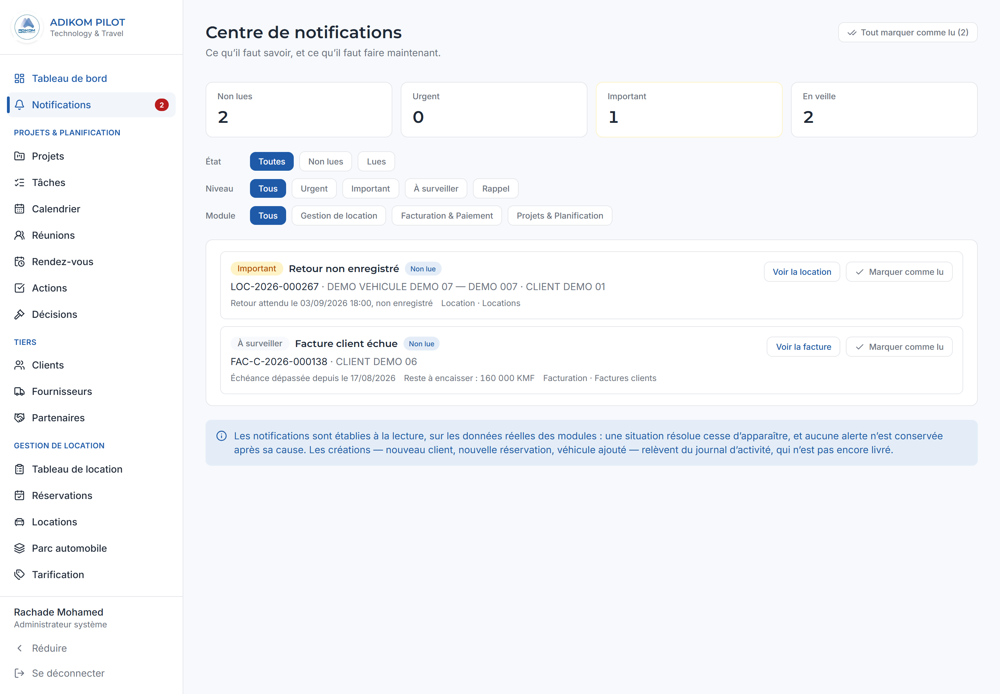

> **Ce qu'il faut observer sur cette capture**
>
> - Des **filtres** : par niveau, par module d'origine, et par état de lecture
>   (*Non lues* / *Lues*).
> - Chaque notification porte **un titre**, **l'objet concerné**, **une phrase
>   de temps** (« Retour attendu le… », « Échéance dépassée depuis le… ») et un
>   **badge de niveau**.
> - Un **lien d'action adapté** : « Voir la location », « Voir la facture »,
>   « Voir la maintenance » — jamais un « Ouvrir » générique.
> - Des boutons pour **marquer comme lu**.

## 5.4 Les quatre niveaux

| Niveau | Couleur | Ce qu'il signifie |
| --- | --- | --- |
| **Urgent** | Rouge | À traiter sans délai |
| **Important** | Orange | À traiter rapidement |
| **À surveiller** | Gris | À garder à l'œil |
| **Rappel** | Bleu | Une échéance qui approche |

## 5.5 Ce que le centre surveille

Onze familles de situations, chacune conditionnée par le droit de lecture
correspondant :

| Famille | Exemples de notifications |
| --- | --- |
| Départs de réservation | « Départ prévu » |
| Retours et contrôles de location | « Retour prévu », « Retour non enregistré », « Contrôle de retour à effectuer » |
| Véhicules immobilisés | « Véhicule immobilisé », « Véhicule immobilisé pendant une location » |
| Maintenances | « Maintenance prévue », « Maintenance en retard » |
| Incidents en location | « Incident sur un véhicule en location » |
| Documents de véhicule | « Document proche de l'expiration », « Document expiré » |
| Factures clients | « Facture client échue » |
| Factures fournisseurs | « Facture fournisseur échue » |
| Tâches | « Échéance de tâche proche », « Tâche en retard » |
| Réunions | « Réunion à venir » |
| Rendez-vous | « Rendez-vous à venir » |

## 5.6 Comment l'utiliser

1. Ouvrez le centre, ou cliquez sur la pastille rouge.
2. Traitez d'abord les notifications **Urgent**, puis **Important**.
3. Cliquez sur le lien d'action pour ouvrir l'objet concerné.
4. Une fois traité, **marquez la notification comme lue**.

## 5.7 Règles importantes

- **Une notification disparaît quand sa cause disparaît.** Enregistrez le retour
  d'un véhicule, et l'alerte « Retour non enregistré » s'efface d'elle-même.
  Vous n'avez rien à nettoyer.
- **Ce qui est conservé, c'est l'état de lecture** : qui a lu quoi, et quand.
- **Vous n'êtes jamais alerté sur ce que vous n'avez pas le droit de voir.**
  Une famille fermée est **nommée** sur l'écran, plutôt que passée sous silence —
  vous savez ainsi qu'il existe une veille à laquelle vous n'avez pas accès.

## 5.8 Erreurs et blocages possibles

| Ce que vous constatez | Explication |
| --- | --- |
| « 0 notification » alors qu'un retour est en retard | Vous n'avez pas la capacité de consulter les locations |
| Une notification citée sans nom de projet | Vous voyez la tâche, mais pas le projet auquel elle appartient. L'échéance reste vraie |
| Le lien mène à un refus d'accès | La notification vous prévient, mais l'écran de destination revérifie vos droits — c'est voulu |

---

# 6 — Module 03 — Projets & Planification

## 6.1 Objectif

Organiser la **vie interne d'ADIKOM** : les projets, le travail à faire, les
réunions, les rendez-vous, les décisions prises et les actions qui en découlent.

Ce module ne concerne pas l'activité commerciale de location — celle-ci relève
du module 05.

## 6.2 Projets

### Où les trouver

Barre latérale → **PROJETS & PLANIFICATION** → **Projets**.

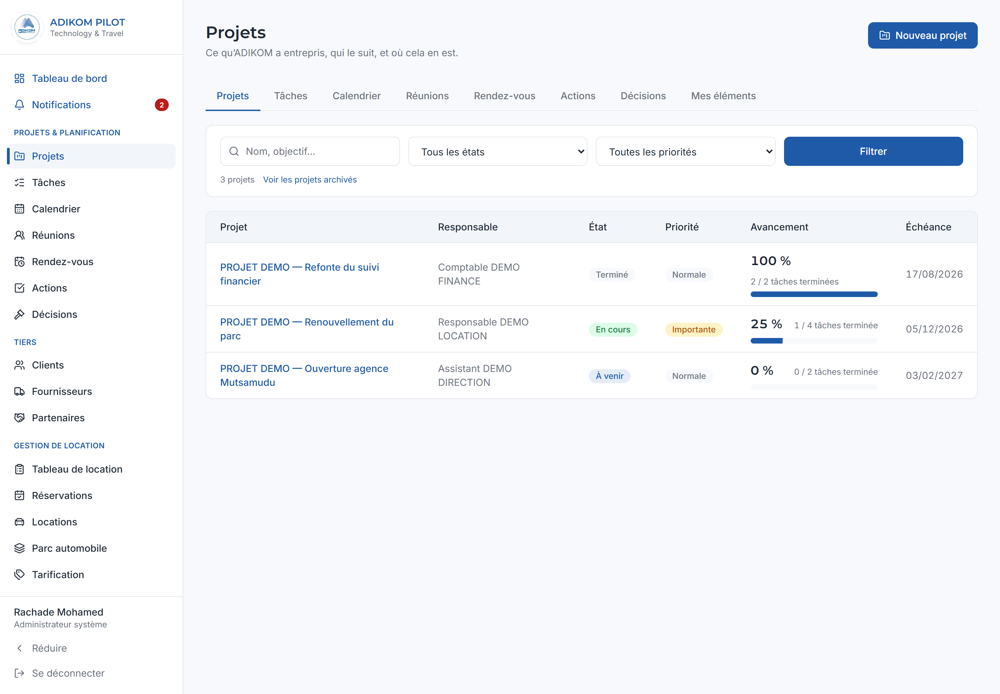

> **Ce qu'il faut observer** : la liste des projets avec leur responsable, leur
> échéance, leur avancement et leur statut. La barre de filtres permet de
> chercher par nom, par statut et par priorité.

### Créer un projet

1. Cliquez sur **« Nouveau projet »** en haut à droite.
2. Renseignez les champs :

| Champ | Obligatoire | Précision |
| --- | --- | --- |
| **Nom** | Oui | Le titre du projet |
| **Description** | Non | Son objet |
| **Responsable** | Non | Un collaborateur d'ADIKOM |
| **Tiers concerné** | Non | Un client, un fournisseur ou un partenaire |
| **Priorité** | Oui | *Faible*, *Normale*, *Importante*, *Urgente* |
| **Date de début** | Non | |
| **Échéance** | Non | Elle alimente le calendrier et les notifications |
| **Statut** | Oui | À la création : *Brouillon* ou *À venir* |

3. Enregistrez. Le projet apparaît dans la liste.

### La fiche d'un projet

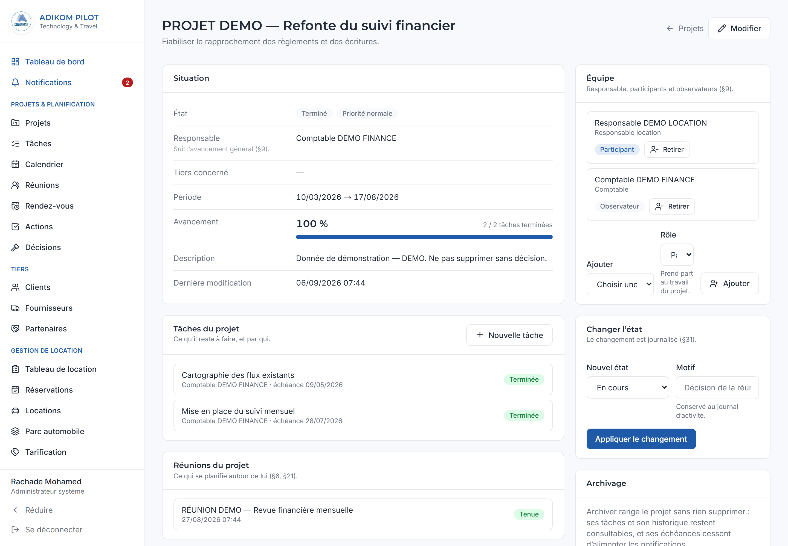

> **Ce qu'il faut observer** : les informations du projet, ses **membres**, ses
> **tâches** et son **avancement**. L'avancement n'est pas saisi : il est
> **calculé** sur les tâches terminées.

### Les six statuts d'un projet

| Statut | Ce qu'il signifie | États atteignables ensuite |
| --- | --- | --- |
| **Brouillon** | En préparation | À venir · En cours · Annulé |
| **À venir** | Prévu, pas commencé | En cours · En pause · Annulé |
| **En cours** | Travail engagé | En pause · Terminé · Annulé |
| **En pause** | Suspendu | En cours · Terminé · Annulé |
| **Terminé** | Achevé | En cours *(reprise possible)* |
| **Annulé** | Abandonné | *(terminal)* |

### Les membres

Deux rôles :

- **Participant** — prend part au travail du projet.
- **Observateur** — suit l'avancement sans y prendre part.

> Le rôle dans un projet **n'accorde aucun droit** dans le système. Les droits
> viennent exclusivement des groupes et des règles individuelles (§11).

## 6.3 Tâches

### Où les trouver

Barre latérale → **Tâches**.

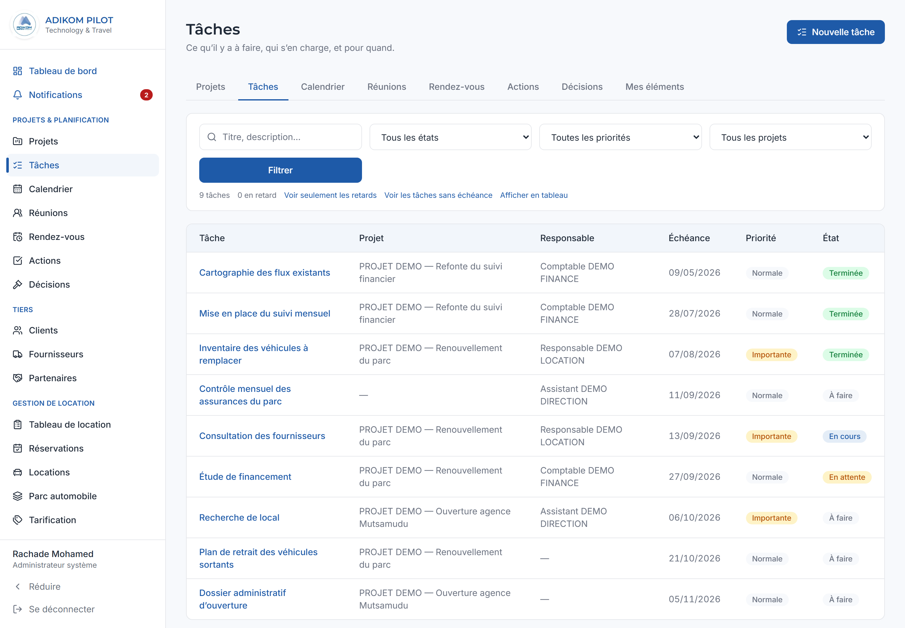

> **Ce qu'il faut observer** : les tâches avec leur projet, leur responsable,
> leur échéance et leur statut. Une tâche dont l'échéance est passée et qui
> n'est ni terminée ni annulée est signalée **en retard**.

### Créer une tâche

Cliquez sur **« Nouvelle tâche »**, puis renseignez :

| Champ | Obligatoire | Précision |
| --- | --- | --- |
| **Titre** | Oui | |
| **Description** | Non | |
| **Projet** | **Non** | Une tâche peut être **indépendante** |
| **Responsable** | Non | |
| **Priorité** | Oui | *Faible*, *Normale*, *Importante*, *Urgente* |
| **Échéance** | Non | Elle alimente le calendrier et la veille |
| **Statut** | Oui | *À faire* à la création |

> **Une tâche n'a pas besoin d'un projet.** C'est volontaire : beaucoup de
> travail interne ne relève d'aucun projet formalisé.

### Les cinq statuts d'une tâche

**À faire** → **En cours** → **En attente** → **Terminée** · **Annulée**

Une tâche terminée peut être rouverte (retour à *À faire* ou *En cours*). Une
tâche annulée est définitive.

### Le tableau (vue Kanban)

La liste des tâches propose une vue en colonnes : *À faire*, *En cours*, *En
attente*, *Terminée*. Les tâches annulées n'y figurent pas — elles restent
accessibles dans la vue liste, avec leur filtre.

## 6.4 Calendrier

### Où le trouver

Barre latérale → **Calendrier**.

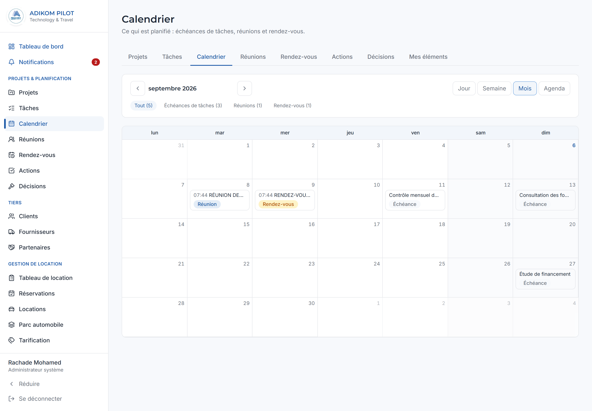

> **Ce qu'il faut observer**
>
> - **Quatre vues** : *Jour*, *Semaine*, *Mois*, *Agenda*. La semaine commence
>   le **lundi**.
> - **Trois couches superposées**, chacune d'une couleur : *Échéances de
>   tâches* (gris), *Réunions* (bleu), *Rendez-vous* (orange). Chaque couche se
>   masque ou s'affiche indépendamment.
> - Les flèches de navigation, pour aller d'une période à l'autre.
> - Les samedis et dimanches sont **grisés**, jamais masqués.

### Règle importante

Le calendrier **ne possède aucun droit propre**. Il montre exactement ce que vos
capacités de lecture vous ouvrent déjà, ni plus ni moins. **Une couche fermée
est nommée** sur l'écran : vous savez qu'elle existe et que vous ne la voyez
pas, plutôt que de croire à une semaine vide.

## 6.5 Réunions

### Où les trouver

Barre latérale → **Réunions**.

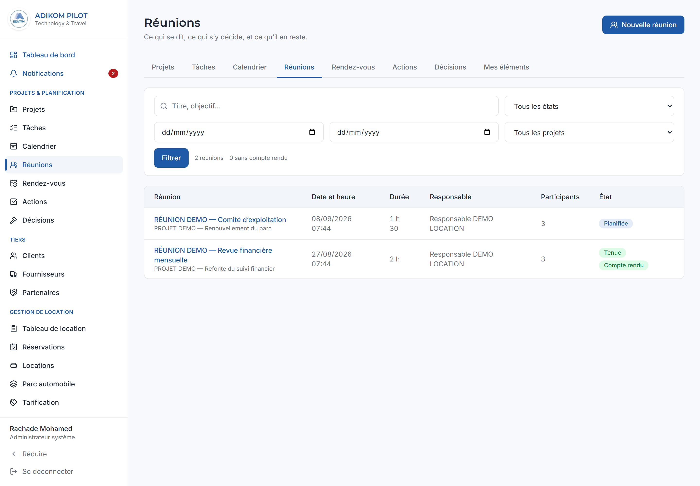

### Créer une réunion

Cliquez sur **« Nouvelle réunion »**, puis renseignez :

| Champ | Obligatoire | Précision |
| --- | --- | --- |
| **Objet** | Oui | |
| **Date et heure** | Oui | Proposé par défaut : **demain à 9 h** |
| **Durée** | Oui | Choix rapides : 15, 30, 45 min, 1 h, 1 h 30, 2 h, 3 h, 4 h, 8 h |
| **Lieu** | Non | |
| **Projet** | Non | |
| **Ordre du jour** | Non | |
| **Participants** | Non | Des collaborateurs d'ADIKOM |

### La fiche d'une réunion

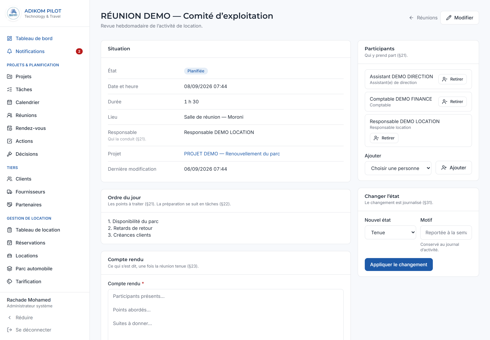

> **Ce qu'il faut observer** : l'ordre du jour, les participants, et — pour une
> réunion tenue — le **compte rendu**, ainsi que les **décisions** et
> **actions** qui en sont issues.

### Les trois états

**Planifiée** → **Tenue** · **Annulée**

Une réunion tenue peut être **replanifiée**. Une réunion annulée est définitive.

> **« Tenue » se déclare, il ne se déduit pas.** Le système vous rappelle qu'une
> réunion est terminée quand son heure de fin est passée, mais il n'écrit rien à
> votre place : c'est vous qui constatez qu'elle a eu lieu.

## 6.6 Rendez-vous

### Où les trouver

Barre latérale → **Rendez-vous**.

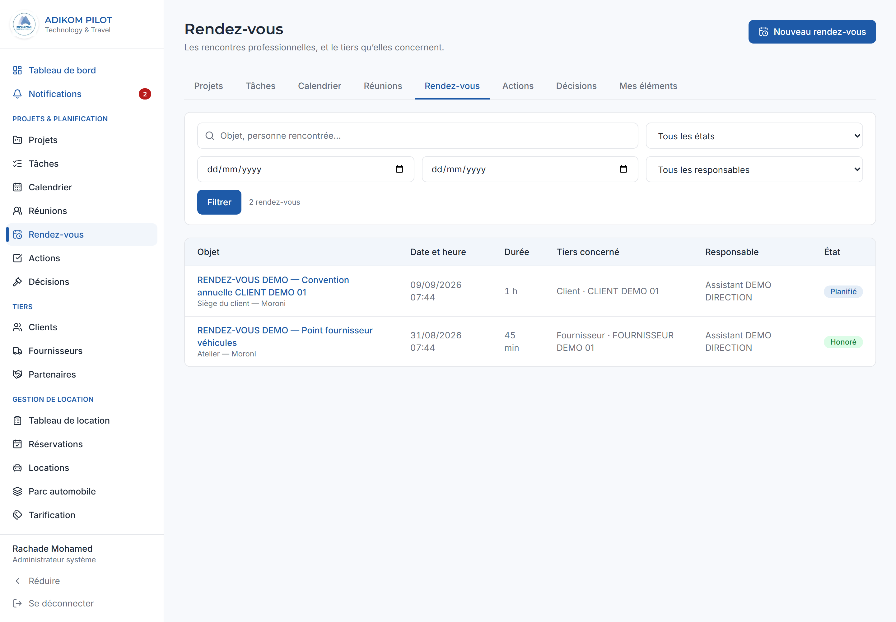

Un rendez-vous fonctionne comme une réunion, à une différence près : il peut
être **rattaché à un tiers** — un client, un fournisseur ou un partenaire.

Ses trois états s'accordent différemment : **Planifié** → **Honoré** ·
**Annulé**. Ce sont les mêmes états qu'une réunion, avec les mots qui
conviennent.

## 6.7 Décisions

### Où les trouver

Barre latérale → **Décisions**.

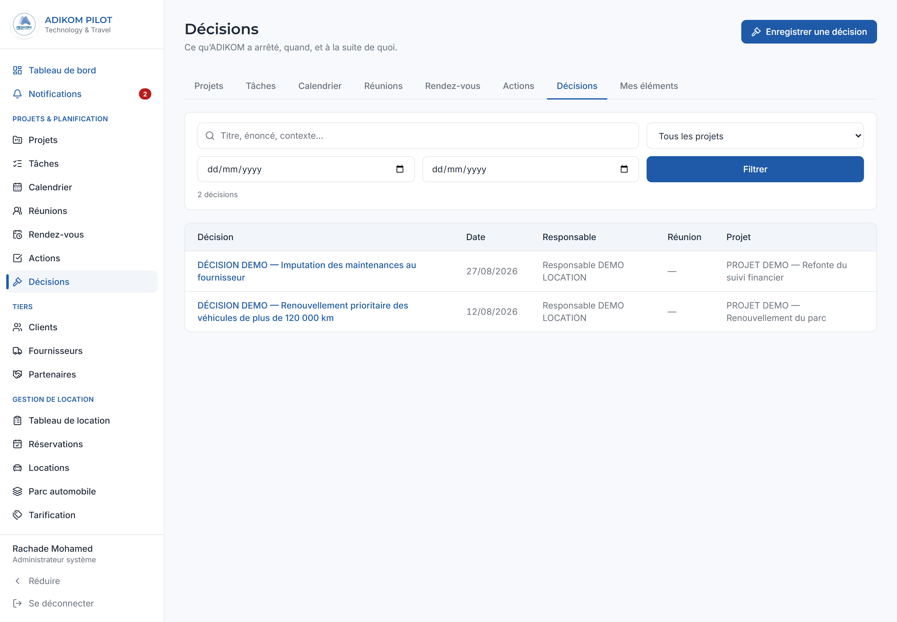

Une décision consigne un arbitrage : ce qui a été décidé, par qui, quand, et
dans quel contexte. Elle peut être rattachée à une réunion ou à un projet.

C'est la mémoire des choix d'ADIKOM. Une décision consignée peut être retrouvée
des mois plus tard, avec son contexte.

## 6.8 Actions

### Où les trouver

Barre latérale → **Actions**.

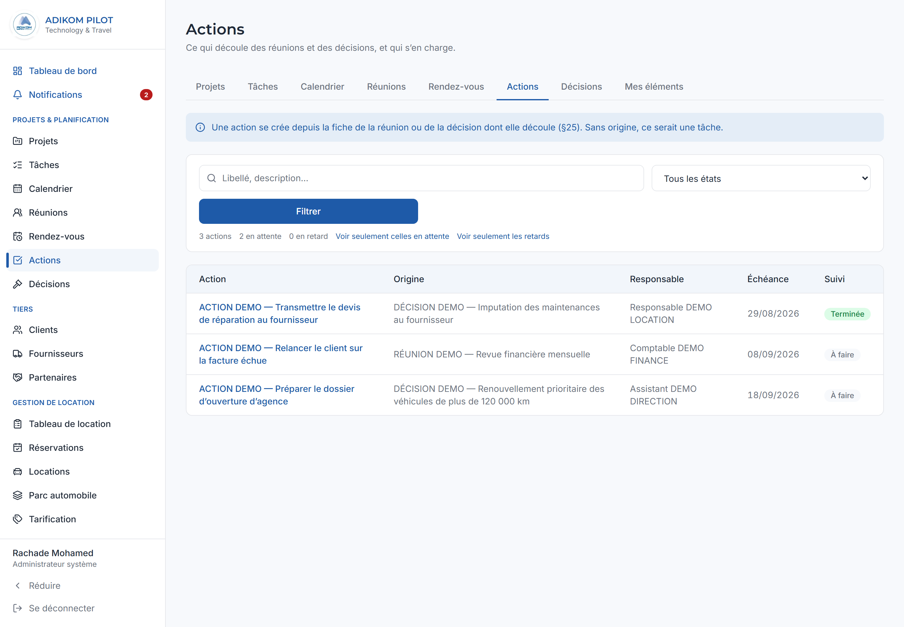

### La règle qui distingue une action d'une tâche

> **Une action sans origine n'est pas une action : c'est une tâche.**

Une action **prolonge toujours** une réunion ou une décision, et en garde le
lien. Le système l'impose : vous ne pouvez pas créer une action détachée.

### Les trois états

**À faire** → **Terminée** · **Annulée**

Une action n'a ni « En cours » ni « En attente » : ce degré de suivi est
précisément ce qui la fait devenir une **tâche**.

### Transformer une action en tâche

Lorsqu'une action réclame un suivi détaillé, la fiche propose de la
**transformer en tâche**.

> **Attention** : à partir de la transformation, **la tâche porte le suivi** et
> **l'action gèle son état**. C'est volontaire : deux états pour un même travail
> finiraient par diverger. L'action conserve la trace de ce qui a été décidé ;
> la tâche porte ce qui reste à faire.

## 6.9 Erreurs et blocages possibles

| Ce que vous constatez | Explication |
| --- | --- |
| « Projet non lisible » sur une tâche | Vous voyez la tâche, pas le projet auquel elle appartient |
| « Utilisateur non lisible » comme responsable | Vous n'avez pas la capacité de consulter les utilisateurs |
| Impossible de créer une action | Une action exige une réunion ou une décision d'origine |
| Une action devenue non modifiable | Elle a été transformée en tâche : le suivi est passé à la tâche |
| Un statut refusé | Le système ne propose que les états atteignables depuis l'état courant |

---

# 7 — Module 04 — Tiers

## 7.1 Objectif

Tenir le **répertoire unique** des personnes et sociétés avec lesquelles ADIKOM
travaille : les clients, les fournisseurs et les partenaires.

> **Aucun tiers n'a de compte dans ADIKOM PILOT.** Un client est une **donnée
> métier**, pas un utilisateur. Il ne se connecte jamais, ne reçoit aucun accès,
> et ne voit rien du système.

## 7.2 Clients

### Où les trouver

Barre latérale → **TIERS** → **Clients**.

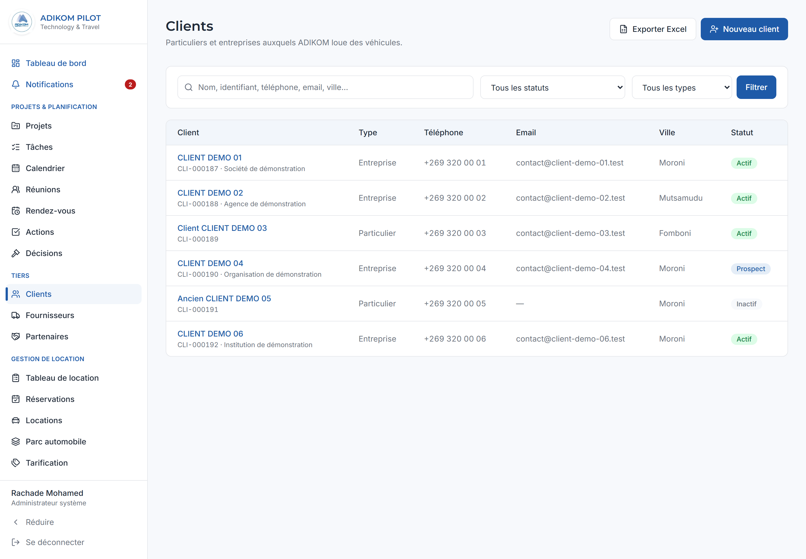

> **Ce qu'il faut observer** : la recherche, les filtres par type et par statut,
> le bouton **« Exporter Excel »** et le bouton **« Nouveau client »**. Chaque
> client porte son **identifiant** (`CLI-…`), attribué automatiquement.

### Créer un client

1. Cliquez sur **« Nouveau client »**.
2. Choisissez le **type** :
   - **Particulier** — une personne physique.
   - **Entreprise** — une société.

   Le formulaire s'adapte : une entreprise demande une raison sociale, un
   particulier un nom et un prénom.
3. Renseignez les champs. Les principaux :

| Section | Champs |
| --- | --- |
| **Identité** | Type, nom / raison sociale, nom commercial, statut |
| **Coordonnées** | Téléphone, e-mail, adresse, ville, pays |
| **Administratif** | Pièce d'identité ou registre, identifiants fiscaux |
| **Suivi** | Notes internes |

4. Enregistrez. Le système attribue l'identifiant et vous l'annonce :
   *« Client créé. Son identifiant est CLI-… »*

### Les quatre statuts d'un client

| Statut | Ce qu'il signifie | Proposé pour une nouvelle location ? |
| --- | --- | --- |
| **Actif** | Client en relation | **Oui** |
| **Prospect** | Contact non encore client | **Oui** |
| **Inactif** | Relation suspendue | Non |
| **Archivé** | Sorti du répertoire actif | Non |

### La fiche d'un client

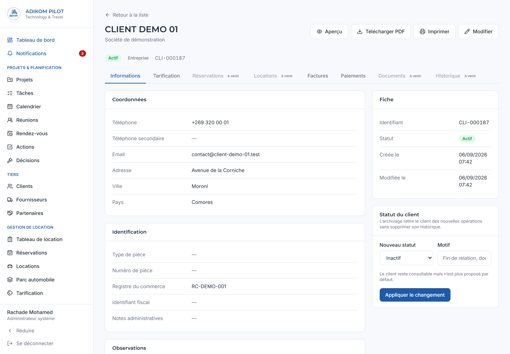

> **Ce qu'il faut observer** : le nom du client en grand titre, les boutons
> d'action en haut à droite (**Modifier**, et selon vos droits **Télécharger le
> PDF** / **Imprimer**), et surtout la **barre d'onglets**.

La fiche comporte **huit onglets** :

| Onglet | État | Contenu |
| --- | --- | --- |
| **Informations** | Disponible | Identité, coordonnées, administratif |
| **Tarification** | Disponible | Tarifs préférentiels du client |
| **Réservations** | *À venir* | |
| **Locations** | *À venir* | |
| **Factures** | Disponible | Ses factures et leur solde |
| **Paiements** | Disponible | Ses règlements |
| **Documents** | *À venir* | |
| **Historique** | *À venir* | |

> Les onglets marqués **« à venir »** sont affichés **inertes**. La fiche
> annonce ce qu'elle contiendra, plutôt que de laisser croire à un écran en
> panne.

### Les tarifs préférentiels

C'est une fonctionnalité importante pour ADIKOM : **chaque client peut
bénéficier de conditions qui lui sont propres**.

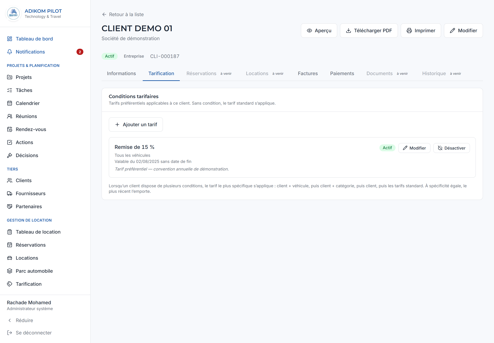

> **Ce qu'il faut observer** : les règles tarifaires applicables à ce client, la
> **portée** de chacune, son **montant** ou sa **remise**, et sa **période de
> validité**.

Une règle tarifaire se définit par :

| Élément | Valeurs possibles |
| --- | --- |
| **Portée** | *Tous les véhicules* · *Une catégorie* · *Un véhicule précis* |
| **Mode** | *Montant* · *Remise en pourcentage* |
| **Unité** | *Par jour* (multiplié par la durée) · *Forfait* (quelle que soit la durée) |
| **Période** | Dates de début et de fin, lorsque la règle est temporaire |

**La règle la plus spécifique l'emporte.** Le système applique automatiquement,
dans l'ordre :

1. Tarif préférentiel du client **sur ce véhicule**
2. Tarif préférentiel du client **sur cette catégorie**
3. Tarif préférentiel du client
4. Tarif standard **du véhicule**
5. Tarif standard **de la catégorie**
6. Tarif standard général

Au moment de créer une réservation, le système affiche **le montant retenu ET la
raison** qui l'a produit — par exemple *« Tarif préférentiel du client sur cette
catégorie »*. Vous savez ainsi toujours **pourquoi** ce prix s'applique.

> **Modifier un tarif est une action sensible**, soumise à sa propre capacité et
> **journalisée**.

## 7.3 Fournisseurs

### Où les trouver

Barre latérale → **TIERS** → **Fournisseurs**.

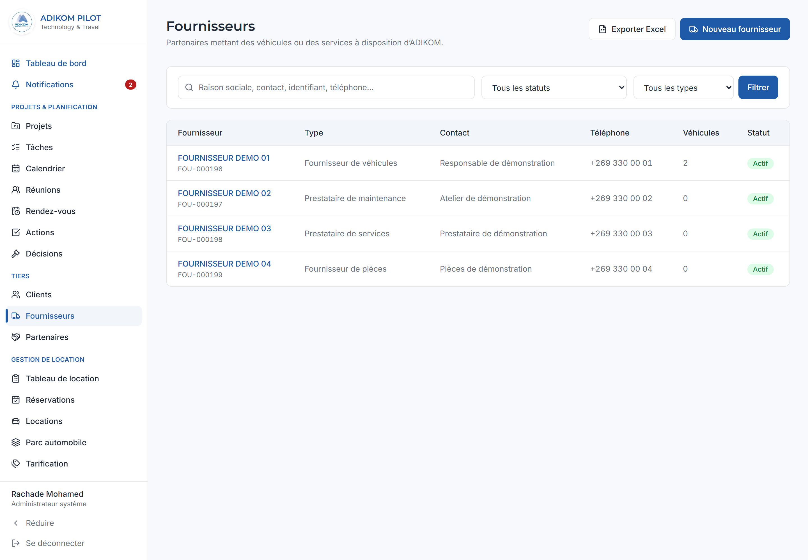

Un fournisseur est une société qui **met des véhicules à disposition d'ADIKOM**,
ou qui lui fournit des prestations.

### La fiche d'un fournisseur

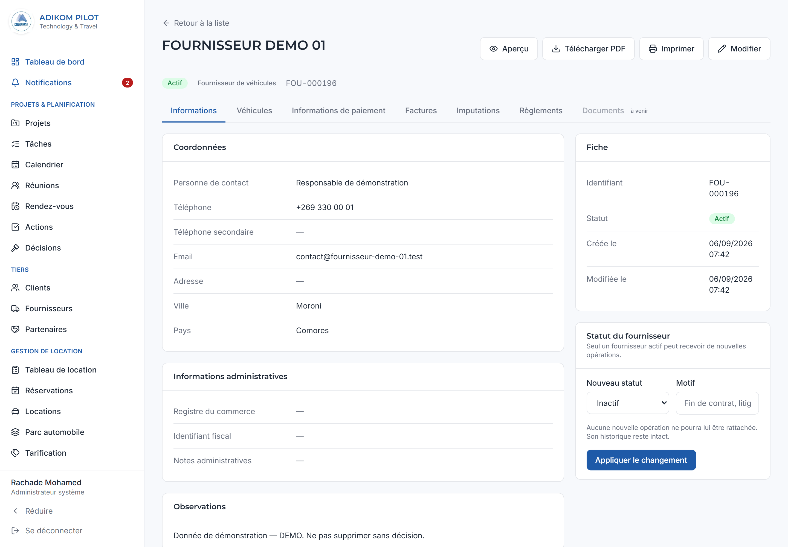

> **Ce qu'il faut observer** : l'identité du fournisseur, ses coordonnées, les
> **véhicules qu'il met à disposition**, et ses **coordonnées de règlement**.

### Les coordonnées de règlement

Un fournisseur peut en avoir **plusieurs**, dont **une principale**.

> **C'est une donnée sensible.** Sa **lecture** et son **écriture** relèvent
> chacune d'une capacité distincte : voir la fiche d'un fournisseur n'ouvre pas
> ses coordonnées bancaires. Toute modification est journalisée.

## 7.4 Partenaires

### Où les trouver

Barre latérale → **TIERS** → **Partenaires**.

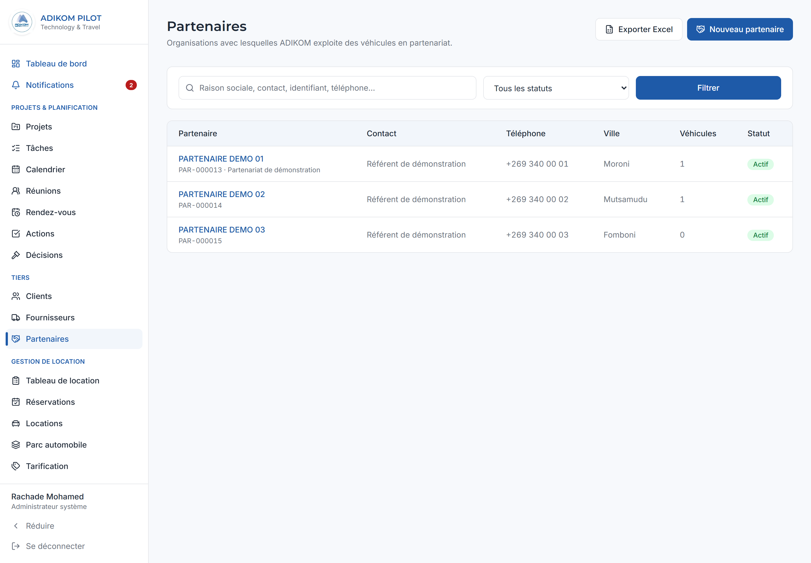

Le menu s'appelle **« Partenaires »** et non « Partenariats ». Ce n'est pas un
détail : ce qui est livré est le **répertoire** des partenaires — consultation,
véhicules rattachés, fiche, export. **La gestion du partenariat lui-même**
(conditions, contrats, projets communs) **reste à construire**. Le menu prendra
le nom « Partenariats » lorsqu'il le fera.

## 7.5 Actions disponibles sur un tiers

| Action | Ce qu'elle fait | Capacité requise |
| --- | --- | --- |
| **Consulter** | Ouvrir la liste et les fiches | *Voir* |
| **Créer** | Ajouter un tiers | *Créer* |
| **Modifier** | Corriger une fiche | *Modifier* |
| **Archiver** | Sortir du répertoire actif, en conservant l'historique | *Archiver* |
| **Exporter Excel** | Produire un classeur de la liste | *Exporter* |
| **Télécharger le PDF** | Produire un document de la fiche | *Télécharger* |
| **Imprimer** | Envoyer la fiche à l'imprimante | *Imprimer* |

## 7.6 Erreurs et blocages possibles

| Ce que vous constatez | Explication |
| --- | --- |
| Un client n'apparaît pas dans une réservation | Il est *Inactif* ou *Archivé* : seuls *Actif* et *Prospect* sont proposés |
| L'onglet Tarification est absent | Vous n'avez pas la capacité de consulter la tarification client |
| Les coordonnées de règlement sont masquées | Elles relèvent d'une capacité distincte |
| Un bouton d'export manque | *Exporter*, *Télécharger* et *Imprimer* sont trois droits séparés |
| Aucun bouton « Supprimer » | Le système ne supprime pas : il archive (§3.3) |

---

# 8 — Module 05 — Gestion de location

C'est **le cœur opérationnel** d'ADIKOM PILOT.

## 8.1 Le cycle complet

```
Réservation → Préparation → Départ → Location en cours → Retour → Contrôle → Clôture
```

> **Chaque flèche est un acte distinct.** Chacun est soumis à sa propre capacité,
> et **refusé par le système si l'étape précédente n'est pas atteinte**. Une
> location ne peut pas « sauter » une étape.

Et lorsqu'un incident survient :

```
Incident → Maintenance → Coût → Imputation → Facture fournisseur → Paiement
```

## 8.2 Tableau de location

### Objectif

Voir en une page **ce qui part, ce qui rentre, ce qui attend un contrôle**.
C'est l'écran de travail quotidien de l'exploitation.

### Où le trouver

Barre latérale → **GESTION DE LOCATION** → **Tableau de location**.

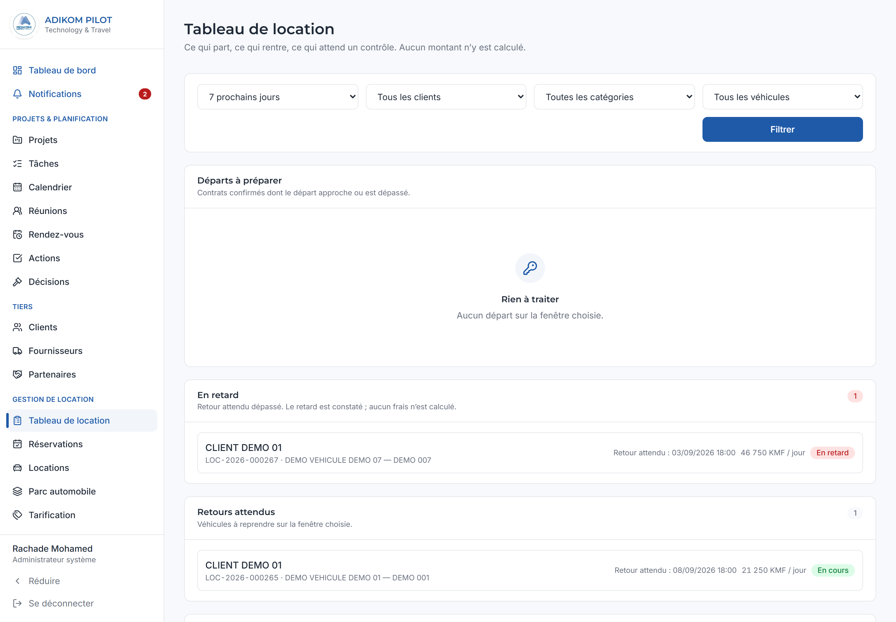

> **Ce qu'il faut observer sur cette capture**
>
> - La phrase d'en-tête : « Ce qui part, ce qui rentre, ce qui attend un
>   contrôle. **Aucun montant n'y est calculé.** »
> - Quatre filtres : **fenêtre de temps** (7 prochains jours par défaut),
>   **client**, **catégorie**, **véhicule**.
> - Des sections successives : **Départs à préparer**, **En retard**, **Retours
>   attendus**, et plus bas **À contrôler**.
> - Quand une section est vide, un message clair : *« Rien à traiter — Aucun
>   départ sur la fenêtre choisie. »* Ce n'est pas une panne.
> - Sur la section **En retard**, la précision : *« Le retard est constaté ;
>   aucun frais n'est calculé. »*

## 8.3 Réservations

### Objectif

Enregistrer un **engagement** : un client, une période, une catégorie ou un
véhicule.

> Une réservation **n'est pas** une location. Ce sont deux objets distincts,
> avec deux jeux de statuts, reliés par une référence.

### Où les trouver

Barre latérale → **Réservations**.

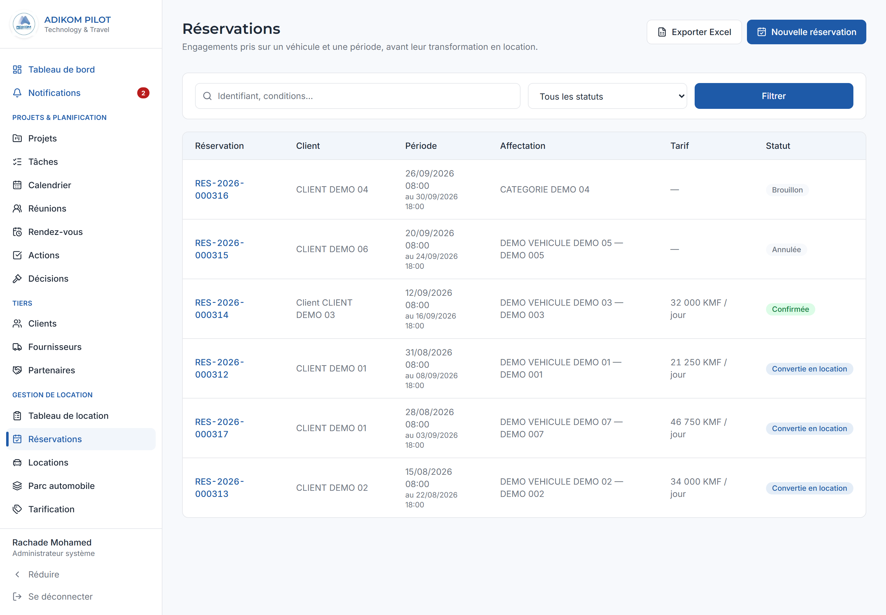

### Créer une réservation

1. Cliquez sur **« Nouvelle réservation »**.
2. Renseignez :

| Champ | Obligatoire | Précision |
| --- | --- | --- |
| **Client** | Oui | Seuls les clients *Actif* et *Prospect* sont proposés |
| **Période** | Oui | Date et heure de début, date et heure de fin |
| **Catégorie** | Oui | La catégorie de véhicule souhaitée |
| **Véhicule** | Non | Peut être attribué plus tard, à la confirmation |
| **Conditions particulières** | Non | |
| **Notes internes** | Non | Non destinées au client |

3. Enregistrez. La réservation reçoit un identifiant `RES-…` et le statut
   **Brouillon** ou **En attente**.

### La fiche d'une réservation

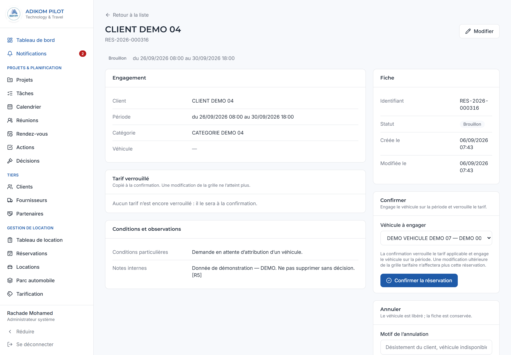

> **Ce qu'il faut observer sur cette capture**
>
> - En haut à gauche : le client et l'identifiant **RES-2026-000316**.
> - Le statut **Brouillon** et la période.
> - Le bloc **« Engagement »** : client, période, catégorie, véhicule
>   (ici « — » : pas encore attribué).
> - Le bloc **« Tarif verrouillé »** avec la mention explicite :
>   *« Aucun tarif n'est encore verrouillé : il le sera à la confirmation. »*
> - À droite, le panneau **« Confirmer »** : une liste **« Véhicule à engager »**
>   et le bouton **« Confirmer la réservation »**.
> - Plus bas à droite, le panneau **« Annuler »**, avec un champ
>   **« Motif de l'annulation »**.

### Confirmer une réservation

C'est l'acte le plus important de cette étape.

1. Choisissez le **véhicule à engager** dans la liste.
2. Cliquez sur **« Confirmer la réservation »**.

**Ce qui se produit alors :**

- Le véhicule est **engagé sur la période** : plus aucune autre réservation ni
  location ne pourra le retenir sur ce créneau.
- **Le tarif est verrouillé.** Le montant, l'unité et la règle qui l'a produit
  sont copiés dans la réservation. *Une modification ultérieure de la grille
  tarifaire n'atteindra plus cette réservation.*

> **Pourquoi le verrouillage ?** Parce qu'un contrat conclu ne se réécrit pas.
> Si ADIKOM révise ses tarifs le mois prochain, les engagements déjà pris
> gardent le prix convenu.

### Les sept statuts d'une réservation

| Statut | Ce qu'il signifie |
| --- | --- |
| **Brouillon** | En préparation |
| **En attente** | Demande enregistrée, pas encore confirmée |
| **Confirmée** | Véhicule engagé, tarif verrouillé |
| **En préparation** | Le véhicule se prépare pour le départ |
| **Convertie en location** | Le départ a eu lieu |
| **Annulée** | Abandonnée ; le véhicule est libéré |
| **Expirée** | *(calculé)* Date de départ passée sans engagement |

> **« Expirée » n'est jamais saisi.** Le système le calcule à la lecture, et
> **uniquement pour les réservations non engagées** (Brouillon et En attente).
> Une réservation confirmée dont la date est passée **bloque encore un
> véhicule** : l'annoncer « expirée » serait trompeur.

### Annuler une réservation

Renseignez le **motif de l'annulation**, puis validez. Le véhicule est libéré,
et **la fiche est conservée** avec sa trace.

## 8.4 Locations

### Objectif

Suivre l'**exécution** du contrat : le départ, la période, le retour, le
contrôle et la clôture.

### Où les trouver

Barre latérale → **Locations**.

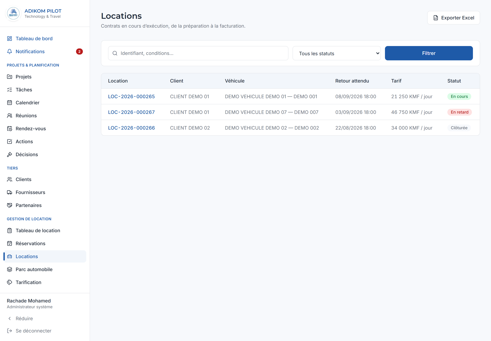

### La fiche d'une location

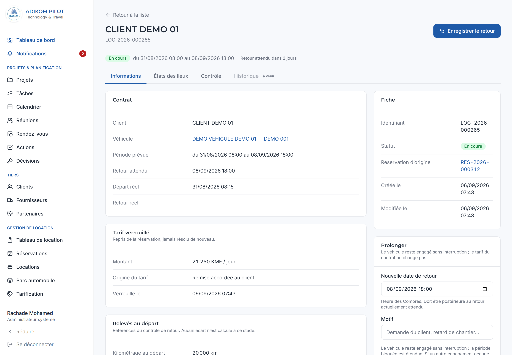

> **Ce qu'il faut observer sur cette capture**
>
> - Le client, l'identifiant **LOC-2026-000265**, le statut **En cours**, la
>   période, et le repère **« Retour attendu dans 2 jours »**.
> - Quatre onglets : **Informations**, **États des lieux**, **Contrôle**, et
>   **Historique** *(à venir)*.
> - Le bloc **« Contrat »** : client, véhicule, période prévue, retour attendu,
>   **départ réel**, **retour réel**.
> - Le bloc **« Tarif verrouillé »** — ici *21 250 KMF / jour*, avec l'origine
>   *« Remise accordée au client »* et la date de verrouillage. La phrase
>   d'en-tête le rappelle : *« Repris de la réservation, jamais résolu de
>   nouveau. »*
> - À droite, le lien vers la **réservation d'origine** (RES-2026-000312) :
>   la chaîne est préservée.
> - Le panneau **« Prolonger »**, avec une nouvelle date de retour et un motif.
> - En haut à droite, le bouton **« Enregistrer le retour »**.

### Les onze statuts d'une location

| Statut | Ce qu'il signifie |
| --- | --- |
| **En préparation** | Le véhicule se prépare |
| **Confirmée** | Contrat établi, départ à venir |
| **En cours** | Véhicule sorti |
| **Prolongée** | Période étendue |
| **En retard** | *(calculé)* Retour attendu dépassé |
| **Retournée** | Véhicule rentré |
| **À contrôler** | En attente de la validation de l'état des lieux |
| **À facturer** | Contrôle validé, facture à établir |
| **Facturée** | Facture client émise |
| **Clôturée** | Dossier fermé |
| **Annulée** | Abandonnée |

### Enregistrer un départ

1. Ouvrez la location, ou la réservation confirmée.
2. Lancez l'écran de **départ**.
3. Remplissez l'**état des lieux de départ** :

| Champ | Précision |
| --- | --- |
| **Kilométrage** | Le relevé du compteur |
| **Niveau de carburant** | *Vide*, *1/4*, *1/2*, *3/4*, *Plein* — en crans, pas en litres |
| **Observations** | État de la carrosserie, accessoires, remarques |
| **Photos** | JPEG, PNG ou WebP, 10 Mo maximum par photo |

4. Validez. La location passe **En cours** et le véhicule **En location**.

> **Le carburant se relève en fractions, pas en litres.** Une jauge n'a pas la
> précision d'un volume ; prétendre le contraire produirait un écart faussement
> exact.

### Prolonger une location

1. Sur la fiche, panneau **« Prolonger »**.
2. Saisissez la **nouvelle date de retour** (postérieure à l'actuelle) et un
   **motif**.
3. Validez.

Le véhicule reste engagé **sans interruption** et la période bloquée est
étendue. **Le tarif du contrat ne change pas.**

> Si un autre engagement occupe déjà le véhicule sur la nouvelle période, la
> prolongation est **refusée**, avec son motif.

### Enregistrer un retour

1. Cliquez sur **« Enregistrer le retour »**.
2. Remplissez l'**état des lieux de retour** — mêmes champs qu'au départ.
3. Validez. La location passe **Retournée**, puis **À contrôler**.

### Contrôler

Onglet **Contrôle**. L'écran présente les relevés de départ et de retour côte à
côte.

Vous validez le contrôle, ou vous signalez un écart. Une fois le contrôle
validé, la location passe **À facturer**.

> **Aucun écart n'est chiffré à ce stade.** Le système constate un kilométrage
> parcouru et une différence de carburant ; il ne calcule **aucun frais**, parce
> que les barèmes correspondants n'ont pas encore été arrêtés par ADIKOM
> (voir §13).

### Clôturer

Une location se clôture **après la facturation**. La facture client ferme le
cycle.

### Les documents produits

Selon vos droits, une location permet de produire :

- le **contrat de location** ;
- le **bon de départ** ;
- le **procès-verbal de retour**.

> Ces documents sont produits **par le serveur, à partir des données du
> dossier**. Ce qui s'affiche à l'aperçu est exactement ce qui se télécharge et
> ce qui s'imprime. Aucune divergence n'est possible.

## 8.5 Parc automobile

### Objectif

Tenir le **référentiel des véhicules** exploités par ADIKOM, quelle que soit
leur origine.

### Où le trouver

Barre latérale → **Parc automobile**.

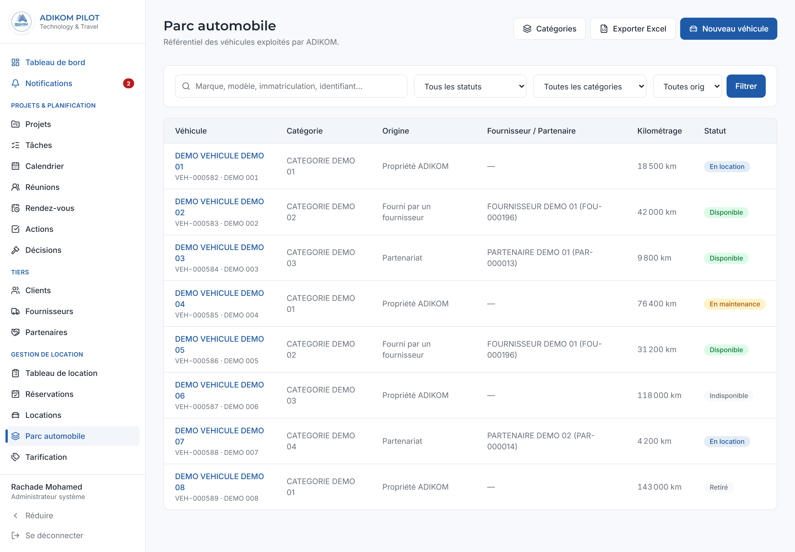

> **Ce qu'il faut observer sur cette capture**
>
> - Trois boutons en haut à droite : **Catégories**, **Exporter Excel**,
>   **Nouveau véhicule**.
> - Les colonnes : **Véhicule** (avec son identifiant `VEH-…` et son
>   immatriculation), **Catégorie**, **Origine**, **Fournisseur / Partenaire**,
>   **Kilométrage**, **Statut**.
> - Les **quatre origines** en action : *Propriété ADIKOM*, *Fourni par un
>   fournisseur*, *Partenariat* — avec, pour les deux dernières, le nom du tiers.
> - Les statuts variés : *En location*, *Disponible*, *En maintenance*,
>   *Indisponible*, *Retiré*.

### Créer un véhicule

Cliquez sur **« Nouveau véhicule »**, puis renseignez :

| Section | Champs |
| --- | --- |
| **Identification** | Marque, modèle, immatriculation, année, couleur |
| **Caractéristiques** | Catégorie, carburant (*Essence*, *Diesel*, *Hybride*, *Électrique*, *Autre*), transmission (*Manuelle*, *Automatique*), nombre de places, kilométrage |
| **Origine** | *Propriété ADIKOM*, *Fourni par un fournisseur*, *Partenariat*, *Autre* — et le tiers concerné |
| **Suivi** | Notes internes |

> **La couleur se choisit dans une liste fermée** (21 valeurs). Ce n'est pas une
> contrainte gratuite : « gris », « Gris » et « GRIS METALLISE » désignaient le
> même véhicule tout en rendant impossible le moindre filtre.

### Les sept statuts d'un véhicule

| Statut | Ce qu'il signifie | Conséquence |
| --- | --- | --- |
| **Disponible** | Exploitable | Proposé, **sous réserve de son calendrier** |
| **Réservé** | Engagé par une réservation | Non proposé sur la période |
| **En location** | Sorti | Non proposé |
| **En maintenance** | En atelier | Non proposé |
| **Immobilisé** | Hors service | Non proposé ; pensez à enregistrer la période d'immobilisation |
| **Indisponible** | Retiré temporairement, sans motif technique | Non proposé |
| **Retiré** | Sorti définitivement du parc | Historique conservé et consultable |

> **Le statut ne remplace pas le calendrier.** Un véhicule « Disponible »
> aujourd'hui peut être réservé demain. La disponibilité réelle se lit sur le
> calendrier du véhicule.

### La fiche d'un véhicule

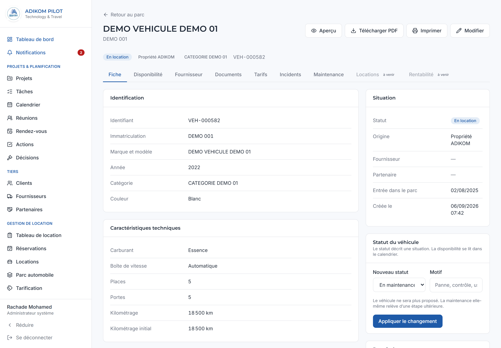

> **Ce qu'il faut observer** : les caractéristiques, l'origine et le
> fournisseur, la **disponibilité** (les périodes occupées, avec leur cause :
> *Réservation*, *Location*, *Maintenance*, *Immobilisation*), les **documents**
> et l'**historique des rattachements fournisseurs**.

### Les documents d'un véhicule

Sept types : **Carte grise**, **Assurance**, **Visite technique**, **Contrat
fournisseur**, **Justificatif de maintenance**, **Document administratif**,
**Autre document**.

Formats acceptés : PDF, JPEG, PNG, WebP — **10 Mo maximum**.

Chaque document peut porter une **date d'expiration**. Le centre de
notifications vous prévient à l'approche de l'échéance, puis lorsqu'elle est
dépassée.

### La garantie de disponibilité

> **Deux engagements ne peuvent pas se chevaucher sur le même véhicule.**
>
> Cette garantie est portée par la base de données elle-même, pas par l'écran.
> Même si deux personnes confirment deux réservations **exactement au même
> instant** sur le même véhicule et la même période, une seule aboutit. L'autre
> reçoit un refus explicite.

## 8.6 Tarification

### Objectif

Définir les **tarifs standards** d'ADIKOM, par catégorie ou par véhicule.

### Où la trouver

Barre latérale → **Tarification**.

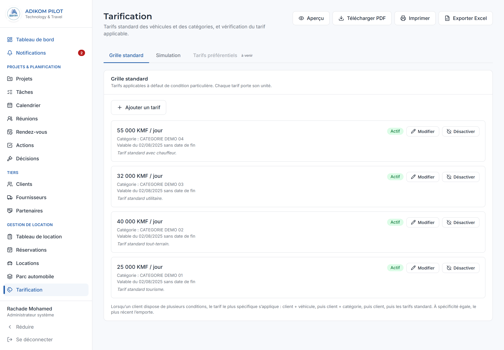

> **Ce qu'il faut observer** : la liste des règles tarifaires, leur portée, leur
> montant, leur unité et leur période. L'écran propose également un
> **simulateur** : choisissez un client, un véhicule et une période, et le
> système affiche le tarif qui s'appliquerait **et la raison**.

### Créer une règle

| Champ | Valeurs |
| --- | --- |
| **Portée** | *Tous les véhicules* · *Une catégorie* · *Un véhicule précis* |
| **Client** | Vide pour un tarif standard, renseigné pour un tarif préférentiel |
| **Mode** | *Montant* · *Remise en pourcentage* |
| **Montant** | En KMF, entier |
| **Unité** | *Par jour* · *Forfait* |
| **Période** | Facultative |

> **Modifier un tarif est journalisé.** Le journal d'activité conserve l'ancien
> et le nouveau montant, ainsi que l'auteur.

## 8.7 Dommages & Incidents

### Objectif

**Constater** ce qui est arrivé à un véhicule : une panne, un accident, une
crevaison, un problème mécanique ou électrique, la perte d'un document.

### Où les trouver

Barre latérale → **Dommages & Incidents**.

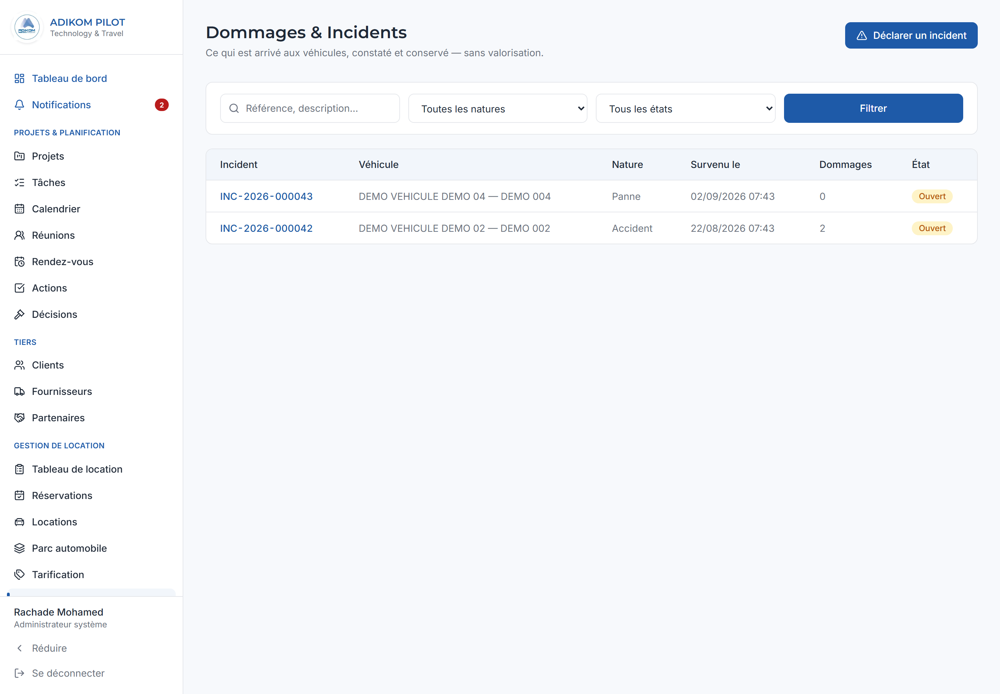

### Créer un incident

Cliquez sur **« Nouvel incident »**, puis renseignez :

| Champ | Obligatoire | Valeurs |
| --- | --- | --- |
| **Véhicule** | Oui | |
| **Location** | Non | Si l'incident est survenu pendant une location |
| **Nature** | Oui | *Panne*, *Accident*, *Crevaison*, *Problème mécanique*, *Problème électrique*, *Perte d'un document*, *Autre incident* |
| **Date et heure** | Oui | |
| **Description** | Oui | Ce qui s'est passé |
| **Photos** | Non | JPEG, PNG, WebP — 10 Mo maximum |

### La fiche d'un incident

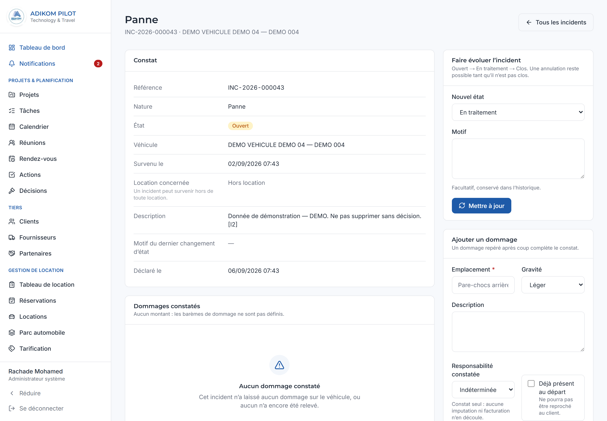

> **Ce qu'il faut observer** : la nature, la date, le véhicule, la location le
> cas échéant, la description, les **dommages constatés** et les **photos**.

### Les dommages constatés

Chaque dommage porte :

- une **gravité** : *Léger*, *Moyen*, *Important* ;
- une **responsabilité** : *Indéterminée*, *Client*, *ADIKOM*, *Fournisseur*.

### Les quatre statuts d'un incident

**Ouvert** → **En traitement** → **Clos** · **Annulé**

### Règle importante

> **Ce module constate, il ne chiffre pas.**
>
> Aucun montant, aucun barème, aucune franchise. La gravité d'un dommage et la
> responsabilité constatée **ne commandent rien** — ni coût, ni imputation, ni
> facturation. Elles décrivent, et c'est tout ce qu'on leur demande à ce stade,
> parce que les barèmes correspondants n'ont pas été arrêtés par ADIKOM.
>
> Le chiffrage se fait dans la **maintenance** (§8.8).

## 8.8 Maintenance

### Objectif

Suivre une **intervention** sur un véhicule : son origine, sa priorité, son
avancement, son coût, et l'éventuelle imputation à un fournisseur.

### Où la trouver

Barre latérale → **Maintenance**.

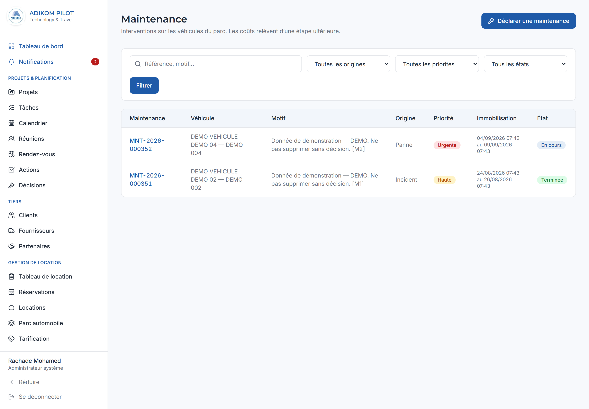

### Créer une maintenance

Cliquez sur **« Nouvelle maintenance »**, puis renseignez :

| Champ | Obligatoire | Valeurs |
| --- | --- | --- |
| **Véhicule** | Oui | |
| **Origine** | Oui | *Panne*, *Incident*, *Retour de location*, *Contrôle*, *Maintenance préventive*, *Autre* |
| **Priorité** | Oui | *Faible*, *Normale*, *Haute*, *Urgente* |
| **Motif** | Oui | |
| **Description** | Non | |
| **Date prévue** | Non | |

### La fiche d'une maintenance

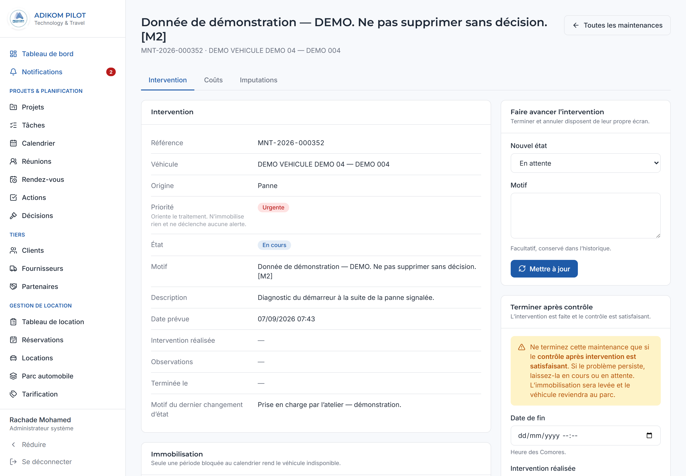

> **Ce qu'il faut observer sur cette capture**
>
> - L'identifiant **MNT-2026-000352** et le véhicule concerné.
> - **Trois onglets** : **Intervention**, **Coûts**, **Imputations**.
> - Le bloc **« Intervention »** : origine (*Panne*), priorité (*Urgente*), état
>   (*En cours*), motif, description, date prévue.
> - La précision sous la priorité : *« Oriente le traitement. **N'immobilise
>   rien** et ne déclenche aucune alerte. »*
> - À droite, **« Faire avancer l'intervention »** : une liste **« Nouvel
>   état »**, un **motif** facultatif conservé dans l'historique, et le bouton
>   **« Mettre à jour »**.
> - Plus bas, **« Terminer après contrôle »** avec un avertissement jaune :
>   *« Ne terminez cette maintenance que si le contrôle après intervention est
>   satisfaisant. Si le problème persiste, laissez-la en cours ou en attente.
>   L'immobilisation sera levée et le véhicule reviendra au parc. »*
> - Le bloc **« Immobilisation »** : *« Seule une période bloquée au calendrier
>   rend le véhicule indisponible. »*

### Les sept statuts d'une maintenance

| Statut | États atteignables ensuite |
| --- | --- |
| **Brouillon** | Planifiée · À diagnostiquer |
| **Planifiée** | À diagnostiquer · En cours · En attente |
| **À diagnostiquer** | En cours · En attente |
| **En cours** | En attente — **et « Terminer » par son propre écran** |
| **En attente** | En cours · À diagnostiquer |
| **Terminée** | *(terminal)* |
| **Annulée** | *(terminal)* |

> **« Terminée » ne s'atteint que depuis « En cours »**, et par l'écran
> *« Terminer après contrôle »*. On ne conclut pas une intervention tant que le
> problème persiste.
>
> Le passage **Brouillon → Planifiée** est un acte d'**engagement** : il relève
> d'une capacité de validation distincte. La fiche cesse d'être une intention et
> devient une opération prévue.

### Les coûts (onglet « Coûts »)

Enregistrez ici les **devis**, puis les **coûts réels** de l'intervention :
pièces, main-d'œuvre, prestations. Chaque ligne porte son libellé et son
montant.

Le total des coûts détermine le **montant imputable** de la maintenance.

### Les imputations (onglet « Imputations »)

Si le véhicule est **fourni par un fournisseur**, le coût de la réparation peut
être **imputé** sur la facture de ce fournisseur. Voir §10.4.

### La période d'immobilisation

**Seule une période d'immobilisation bloque le calendrier d'un véhicule.** Ni la
priorité, ni le statut de la maintenance ne le font. Si le véhicule ne doit pas
être loué pendant l'intervention, enregistrez explicitement la période.

## 8.9 Erreurs et blocages possibles

| Ce que vous constatez | Explication |
| --- | --- |
| « Le véhicule n'est pas disponible sur cette période » | Un autre engagement l'occupe déjà. Consultez son calendrier |
| Impossible de confirmer une réservation | Aucun véhicule disponible, ou vous n'avez pas la capacité de confirmer |
| Impossible d'enregistrer un départ | La réservation n'est pas confirmée |
| Impossible d'enregistrer un retour | La location n'est pas partie |
| Impossible de clôturer | La facture client n'est pas émise |
| Le véhicule reste loué malgré une maintenance | Aucune période d'immobilisation n'a été enregistrée |
| « Terminée » absente des états proposés | La maintenance n'est pas *En cours*, ou vous devez passer par « Terminer après contrôle » |
| Un tarif ne change pas après modification de la grille | Il est **verrouillé** depuis la confirmation. C'est voulu |

---

# 9 — Module 06 — Banques & Caisses

## 9.1 Objectif

Tenir les **comptes financiers** d'ADIKOM — banques et caisses — et suivre les
mouvements qui les affectent.

## 9.2 Comptes

### Où les trouver

Barre latérale → **BANQUES & CAISSES** → **Comptes**.

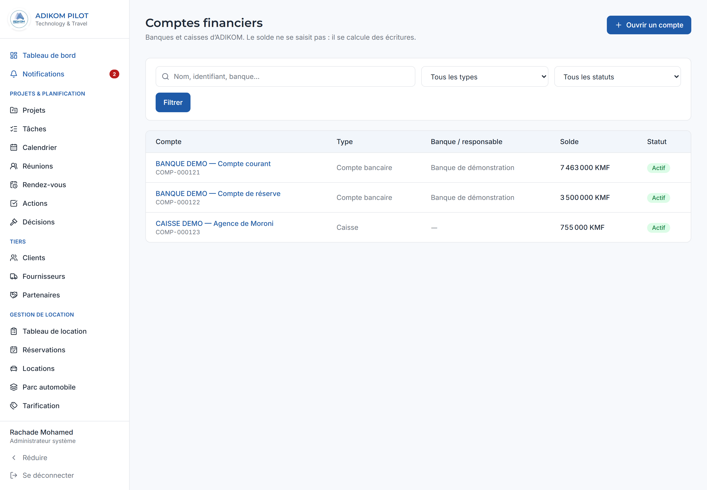

> **Ce qu'il faut observer** : chaque compte avec son identifiant `COMP-…`, son
> type, son établissement ou son responsable, son **solde** et son statut.

### Créer un compte

| Champ | Précision |
| --- | --- |
| **Type** | *Compte bancaire* ou *Caisse* |
| **Libellé** | Le nom du compte |
| **Banque** *(compte bancaire)* ou **Responsable** *(caisse)* | |
| **Numéro / références** | |
| **Devise** | KMF |
| **Statut** | *Actif*, *Inactif*, *Archivé* |

### Les trois statuts

| Statut | Conséquence |
| --- | --- |
| **Actif** | Proposé pour les nouvelles opérations |
| **Inactif** | N'est plus proposé ; son historique reste consultable |
| **Archivé** | N'est plus proposé ; son historique reste consultable |

### La fiche d'un compte

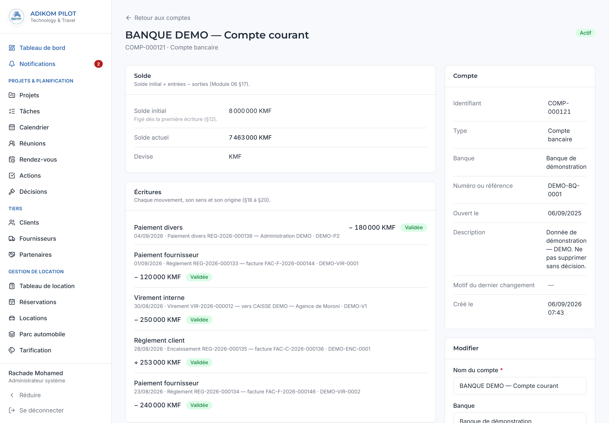

> **Ce qu'il faut observer** : le solde du compte et le détail de ses écritures.
> **Le solde n'est pas saisi** : il est calculé à partir des écritures.

## 9.3 Écritures

### Où les trouver

Barre latérale → **Écritures**.

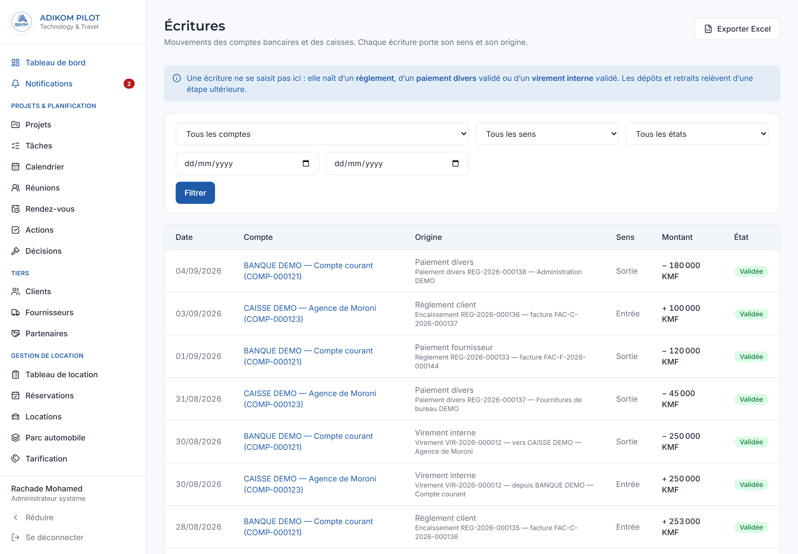

> **Ce qu'il faut observer** : chaque écriture avec sa date, son compte, son
> **sens** (Entrée / Sortie), son montant **signé** (`+` ou `−`), sa nature et
> l'opération qui l'a produite.

### Les natures d'écriture

| Nature | Produite par |
| --- | --- |
| **Règlement client** | Un encaissement de facture client |
| **Paiement fournisseur** | Un règlement de facture fournisseur |
| **Paiement divers** | Un décaissement sans facture |
| **Virement interne** | Un virement entre deux comptes d'ADIKOM |
| **Dépôt** · **Retrait** · **Correction autorisée** | *Au vocabulaire, aucun acte ne les produit à ce jour* |

### Règle fondamentale

> **Une écriture ne s'écrit jamais à la main.**
>
> Elle **naît toujours d'une opération** — un règlement, un virement, un
> paiement divers — et elle en reprend obligatoirement le compte, le montant et
> le sens. Le système refuse une écriture qui ne correspondrait pas à
> l'opération dont elle se réclame.
>
> C'est ce qui garantit qu'un solde est toujours **explicable ligne à ligne**.

## 9.4 Virement interne

### Objectif

Déplacer des fonds **d'un compte d'ADIKOM vers un autre**. Ce n'est ni une
recette ni une dépense : l'argent reste chez ADIKOM.

### Où le trouver

Barre latérale → **Virement interne**.

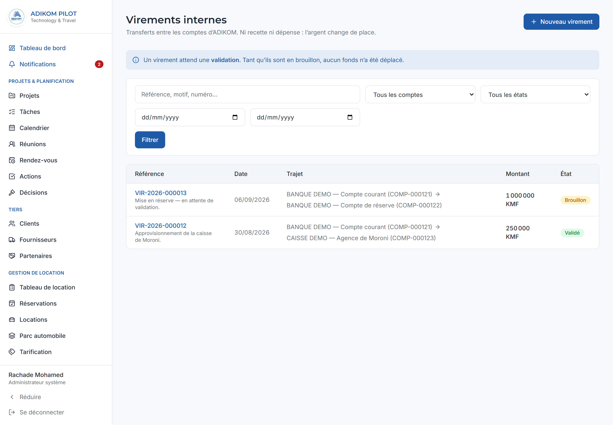

### Créer un virement

Cliquez sur **« Nouveau virement »**, puis renseignez :

| Champ | Obligatoire | Précision |
| --- | --- | --- |
| **Compte source** | Oui | Débité à la validation |
| **Compte destination** | Oui | Crédité du même montant |
| **Montant** | Oui | En KMF entiers |
| **Date** | Oui | |
| **Motif** | Oui | |
| **Référence externe** | Non | La référence de la banque, par exemple |
| **Commentaire** | Non | |

Le virement est créé en **Brouillon**.

### La fiche d'un virement

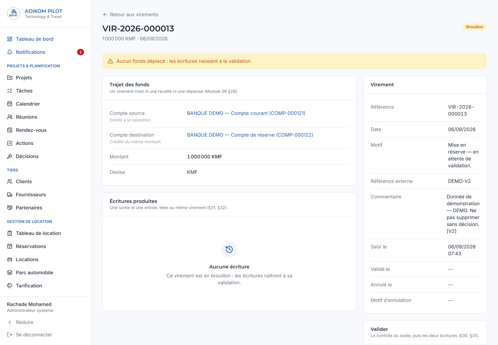

> **Ce qu'il faut observer sur cette capture**
>
> - L'identifiant **VIR-2026-000013**, le montant et la date.
> - Le bandeau jaune, en toutes lettres : *« **Aucun fonds déplacé** : les
>   écritures naissent à la validation. »*
> - Le bloc **« Trajet des fonds »** : compte source (*débité à la validation*),
>   compte destination (*crédité du même montant*), montant, devise.
> - Le bloc **« Écritures produites »**, encore vide : *« Ce virement est en
>   brouillon : les écritures naîtront à sa validation. »*
> - À droite, l'historique : **Saisi le**, **Validé le**, **Annulé le** — et le
>   panneau **« Valider »**.

### Les trois états

| État | Effet sur la trésorerie |
| --- | --- |
| **Brouillon** | **Aucun fonds déplacé** : les écritures naissent à la validation |
| **Validé** | Le compte source est débité, le compte destination crédité |
| **Annulé** | Les deux écritures sont annulées ; les soldes sont revenus |

### Valider un virement

C'est un **acte distinct de la saisie**, soumis à sa propre capacité.

Au moment de la validation, le système contrôle le solde, puis produit **deux
écritures liées** : une **sortie** sur le compte source, une **entrée** sur le
compte destination.

> **Jamais l'une sans l'autre.** La base vérifie cette parité au moment de
> valider la transaction : **un virement à moitié écrit n'existe pas**. Si l'une
> des deux écritures échoue, aucune des deux n'est enregistrée.

## 9.5 Erreurs et blocages possibles

| Ce que vous constatez | Explication |
| --- | --- |
| Un compte n'est pas proposé | Il est *Inactif* ou *Archivé* |
| Le solde ne bouge pas après saisie d'un virement | Le virement est en **Brouillon**. Il faut le **valider** |
| Impossible de valider un virement | Vous n'avez pas la capacité de validation — saisir et valider sont deux droits distincts |
| Aucun bouton pour créer une écriture directement | C'est voulu : une écriture naît d'une opération, jamais d'une saisie libre |
| Le solde devient négatif | Aucun contrôle de découvert n'est posé : la règle n'a pas été arrêtée par ADIKOM (§13) |

---

# 10 — Module 07 — Facturation & Paiement

## 10.1 La règle centrale : imputation ≠ paiement

C'est **la règle la plus importante du système financier d'ADIKOM**. Elle mérite
d'être comprise avant tout le reste.

Un fournisseur met un véhicule à disposition d'ADIKOM pour **500 000 KMF**. Le
véhicule tombe en panne pendant son exploitation. ADIKOM le répare pour
**300 000 KMF**. Ce coût peut être **imputé** sur la facture du fournisseur.

```
Facture fournisseur (montant brut)     500 000 KMF
  − Imputation de maintenance          300 000 KMF   ← n'est PAS un paiement
  = Net à payer                        200 000 KMF
  − Règlement effectué                 120 000 KMF   ← EST un paiement
  = Reste dû                            80 000 KMF
```

> **Une imputation réduit ce qu'ADIKOM doit ; elle ne le paie pas.**
>
> Aucun compte n'est mouvementé par une imputation. Aucune écriture n'est
> produite. Le système conserve ces **cinq grandeurs séparément**, et chaque
> imputation reste identifiable, rattachée à sa maintenance, à son véhicule et à
> son fournisseur.
>
> Un système qui confondrait les deux annoncerait une dette de 500 000 KMF là où
> ADIKOM en doit 80 000.

## 10.2 Factures clients

### Où les trouver

Barre latérale → **FACTURATION & PAIEMENT** → **Factures clients**.

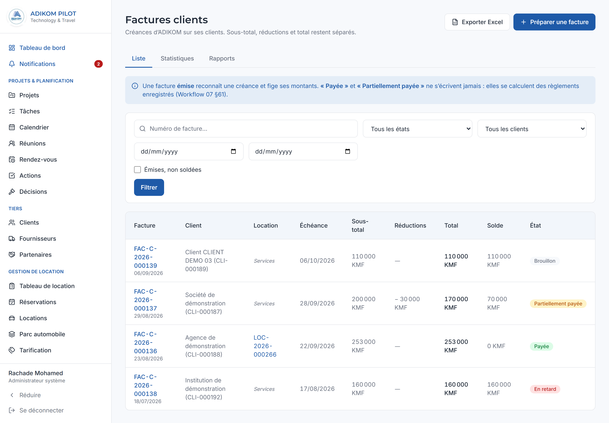

> **Ce qu'il faut observer** : trois onglets — **Liste**, **Statistiques**,
> **Rapports** — les filtres, et pour chaque facture son numéro, son client, son
> échéance, son total, l'encaissé, le solde et son état.

### Établir une facture client

1. Cliquez sur **« Nouvelle facture »**.
2. Choisissez le **client** et, le cas échéant, la **location** à facturer.
3. Renseignez la **date de facture** et l'**échéance**.
4. Ajoutez les **lignes**. Quatre natures :

| Nature | Ce qu'elle porte |
| --- | --- |
| **Location** | La prestation elle-même, **au tarif verrouillé du contrat** |
| **Service supplémentaire** | Une prestation ajoutée |
| **Frais** | Retard, carburant, dommage, équipement manquant |
| **Réduction** | **Se soustrait** du total. Le montant reste positif : c'est la nature qui porte le sens |

5. La facture est en **Brouillon**. Vérifiez-la.
6. **Émettez-la.**

### La fiche d'une facture client

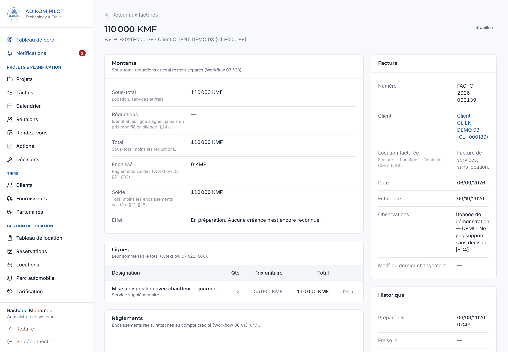

> **Ce qu'il faut observer** : le total, l'état, le client, les lignes, les
> **règlements enregistrés** et le **solde restant**.

### Les six états d'une facture client

| État | Ce qu'il signifie pour l'argent | Écrit ou calculé ? |
| --- | --- | --- |
| **Brouillon** | En préparation. Aucune créance n'est encore reconnue | Écrit |
| **Émise** | Créance reconnue. Ses lignes et ses montants sont **figés** | Écrit |
| **Partiellement payée** | Partiellement encaissée. Un solde subsiste | **Calculé** |
| **Payée** | Intégralement encaissée | **Calculé** |
| **En retard** | Échéance dépassée et solde non encaissé | **Calculé** |
| **Annulée** | Annulée. La location redevient « À facturer » | Écrit |

> **Une facture émise ne se recalcule pas.** Ses lignes sont figées. Une erreur
> **s'annule et se refait** — elle ne se réécrit pas. C'est une exigence
> comptable, pas une limite technique.

### Enregistrer un règlement client

Depuis la fiche de la facture, ajoutez un règlement :

| Champ | Précision |
| --- | --- |
| **Montant** | En KMF entiers |
| **Date** | |
| **Mode** | *Virement bancaire*, *Espèces*, *Dépôt bancaire*, *Chèque*, *Autre mode* |
| **Compte encaisseur** | Le compte d'ADIKOM crédité |
| **Référence** | Numéro de chèque, référence de virement… |

> **Un règlement est validé dès sa saisie**, en **un seul geste**. Il ne se
> valide pas en deux temps, parce qu'il **constate un encaissement déjà
> survenu** : l'argent est arrivé. Il reste annulable.
>
> Le règlement produit automatiquement une **écriture de trésorerie** sur le
> compte encaisseur.

> **Un versement supérieur au solde est refusé**, avec son motif. La règle du
> trop-perçu n'a pas été arrêtée par ADIKOM (§13).

### Statistiques et rapports

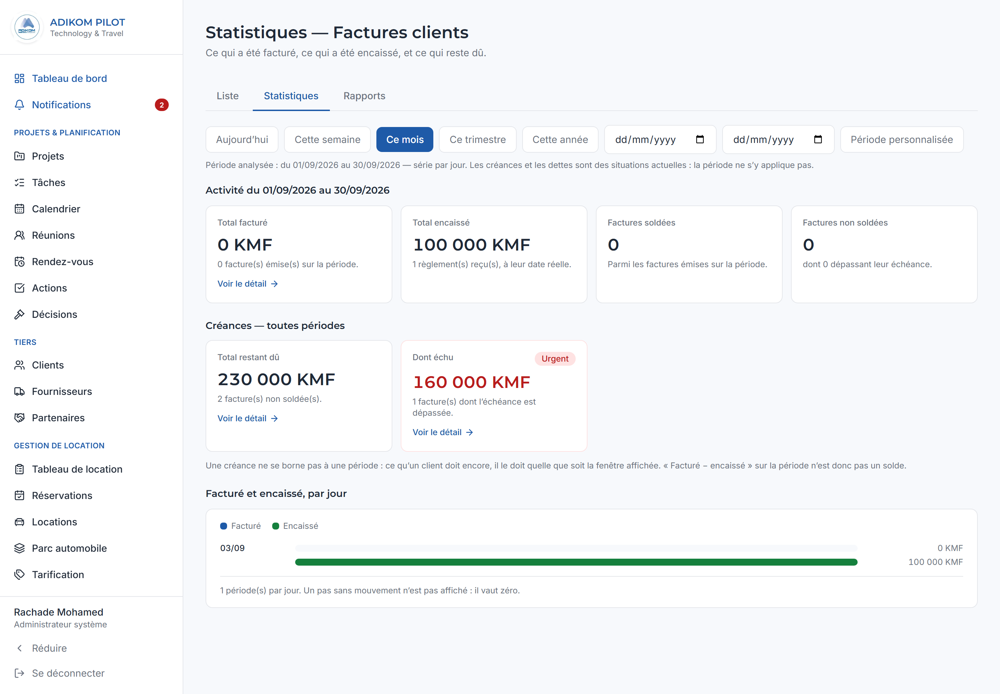

> **Ce qu'il faut observer** : les montants facturés, encaissés et restant dus
> sur la période choisie, avec un découpage par grain de temps. L'onglet
> **Rapports** propose la même matière sous forme de tableaux détaillés.

## 10.3 Factures fournisseurs

### Où les trouver

Barre latérale → **Factures fournisseurs**.

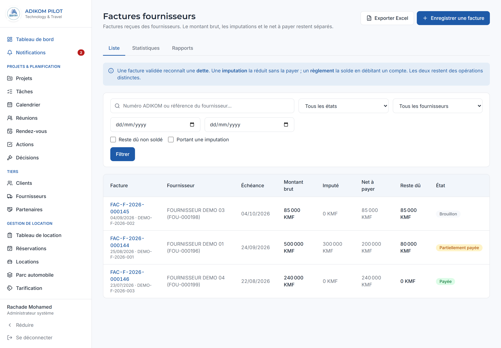

> **Ce qu'il faut observer sur cette capture**
>
> - Le bandeau bleu qui pose la règle : *« Une facture validée reconnaît une
>   **dette**. Une **imputation** la réduit sans la payer ; un **règlement** la
>   solde en débitant un compte. Les deux restent des opérations distinctes. »*
> - Deux cases à cocher utiles : **« Reste dû non soldé »** et **« Portant une
>   imputation »**.
> - **Sept colonnes** qui disent tout : *Facture*, *Fournisseur*, *Échéance*,
>   **Montant brut**, **Imputé**, **Net à payer**, **Reste dû**, *État*.
> - La ligne **FAC-F-2026-000144** montre le scénario ADIKOM en entier :
>   **500 000** brut, **300 000** imputés, **200 000** nets, **80 000** restant
>   dus, état *Partiellement payée*.

### Enregistrer une facture fournisseur

1. Cliquez sur **« Enregistrer une facture »**.
2. Renseignez :

| Champ | Obligatoire | Précision |
| --- | --- | --- |
| **Fournisseur** | Oui | |
| **Référence du fournisseur** | Oui | Le numéro porté par le document reçu |
| **Date de facture** | Oui | |
| **Échéance** | Oui | |
| **Lignes** | Oui | Leur somme fait le **montant brut** |
| **Observations** | Non | |

3. La facture est en **Brouillon**.
4. Faites-la passer **En attente** (saisie complète), puis **Validez-la** après
   contrôle.

### La fiche d'une facture fournisseur

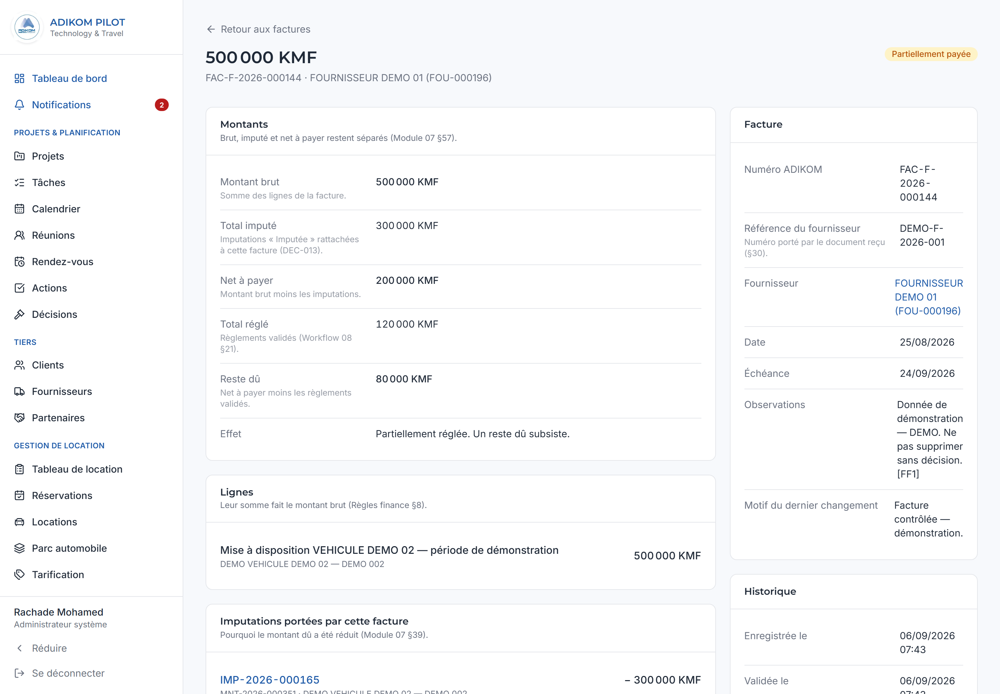

> **Ce qu'il faut observer sur cette capture — c'est l'écran le plus important
> du module**
>
> Le bloc **« Montants »** décompose les cinq grandeurs, chacune expliquée :
>
> | Ligne | Valeur | Explication affichée |
> | --- | --- | --- |
> | **Montant brut** | 500 000 KMF | « Somme des lignes de la facture » |
> | **Total imputé** | 300 000 KMF | « Imputations "Imputée" rattachées à cette facture » |
> | **Net à payer** | 200 000 KMF | « Montant brut moins les imputations » |
> | **Total réglé** | 120 000 KMF | « Règlements validés » |
> | **Reste dû** | 80 000 KMF | « Net à payer moins les règlements validés » |
> | **Effet** | | « Partiellement réglée. Un reste dû subsiste. » |
>
> Plus bas, le bloc **« Imputations portées par cette facture »** — sous-titré
> *« Pourquoi le montant dû a été réduit »* — cite **IMP-2026-000165** pour
> **− 300 000 KMF**, avec la maintenance et le véhicule d'origine.
>
> Et à droite, l'historique complet : *Enregistrée le*, *Validée le*,
> *Annulée le*.

### Les sept états d'une facture fournisseur

| État | Ce qu'il signifie pour l'argent |
| --- | --- |
| **Brouillon** | En saisie. Aucune dette n'est encore reconnue |
| **En attente** | Saisie complète, en attente de contrôle. Aucune dette reconnue |
| **Validée** | **Dette reconnue.** La facture peut recevoir des imputations et des règlements |
| **Partiellement payée** | *(calculé)* Partiellement réglée. Un reste dû subsiste |
| **Payée** | *(calculé)* Intégralement réglée |
| **En retard** | *(calculé)* Échéance dépassée et reste dû non soldé |
| **Annulée** | Ne peut plus recevoir ni imputation ni règlement |

> **Seule une facture VALIDÉE reçoit une imputation ou un règlement.** Ni un
> brouillon, ni une facture en attente, ni une facture annulée.

### Enregistrer un règlement fournisseur

Mêmes principes que pour un règlement client : **un seul geste**, validé dès sa
saisie, annulable, et produisant une **écriture de sortie** sur le compte
payeur.

## 10.4 Imputations

### Objectif

Rattacher le **coût d'une maintenance** à la **facture du fournisseur** qui met
le véhicule à disposition, afin de réduire ce qu'ADIKOM lui doit.

### Où les trouver

Barre latérale → **Imputations**.

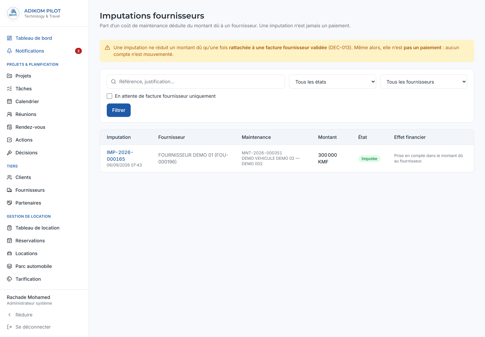

### Le parcours d'une imputation

1. **Depuis la maintenance** — onglet *Imputations* — créez l'imputation. Elle
   naît en **Brouillon**.
2. Renseignez le **montant imputé** et la **justification** (pourquoi ce montant
   est déduit).
3. Passez-la **À valider**, puis **Validez-la**.
4. **Rattachez-la à une facture fournisseur validée** du **même fournisseur**.
   Elle passe alors **Imputée**.

### La fiche d'une imputation

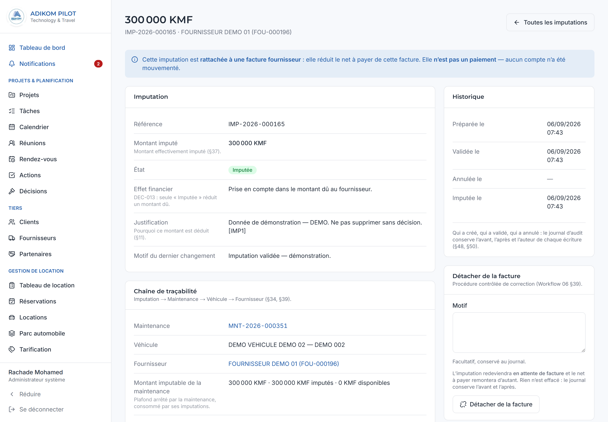

> **Ce qu'il faut observer sur cette capture**
>
> - Le montant **300 000 KMF** et l'identifiant **IMP-2026-000165**.
> - Le bandeau bleu, en toutes lettres : *« Cette imputation est **rattachée à
>   une facture fournisseur** : elle réduit le net à payer de cette facture.
>   Elle **n'est pas un paiement** — aucun compte n'a été mouvementé. »*
> - L'**état** *Imputée* et son **effet financier** : *« Prise en compte dans le
>   montant dû au fournisseur. »*
> - La **justification** : pourquoi ce montant est déduit.
> - Le bloc **« Chaîne de traçabilité »** — sous-titré *Imputation → Maintenance
>   → Véhicule → Fournisseur* — qui cite **MNT-2026-000351**, le véhicule
>   **DEMO 002**, et **FOURNISSEUR DEMO 01**.
> - Le **montant imputable de la maintenance** : *« 300 000 KMF · 300 000 KMF
>   imputés · 0 KMF disponibles »* — le plafond, et ce qu'il en reste.
> - À droite, l'historique daté : *Préparée le*, *Validée le*, *Imputée le*.
> - Le panneau **« Détacher de la facture »**, avec son motif, et l'explication :
>   *« L'imputation redeviendra en attente de facture et le net à payer
>   remontera d'autant. Rien n'est effacé : le journal conserve l'avant et
>   l'après. »*

### Les cinq états d'une imputation

| État | Effet sur un montant dû |
| --- | --- |
| **Brouillon** | En préparation. **Aucun effet** |
| **À valider** | Soumise à validation. **Aucun effet** |
| **Validée** | En attente de facture fournisseur. **Ne réduit encore aucun montant dû** |
| **Imputée** | **Prise en compte dans le montant dû au fournisseur** |
| **Annulée** | Le montant imputable qu'elle consommait est redevenu disponible |

> **Seule une imputation « Imputée » réduit une dette.** Une imputation validée
> mais non rattachée à une facture est en attente : elle ne change encore rien.
>
> L'écran l'appelle **« Imputation en attente de facture »**. Ce n'est pas un
> sixième état : c'est la lecture de *Validée* sans facture rattachée.

### Le plafond

> **Une imputation ne peut jamais dépasser le montant imputable de sa
> maintenance.** Ce plafond est celui des coûts réellement enregistrés. Une
> maintenance de 300 000 KMF ne peut pas produire 400 000 KMF d'imputations,
> quel qu'en soit le nombre.

### Modifier ou annuler

- Une imputation se **modifie** tant qu'elle est *Brouillon* ou *À valider*.
- Elle s'**annule** tant qu'elle n'est ni *Imputée* ni déjà *Annulée*.
- Une imputation *Imputée* se **détache** de sa facture — procédure contrôlée,
  avec motif, qui fait remonter le net à payer d'autant.

## 10.5 Paiements divers

### Objectif

Enregistrer un **décaissement sans facture** : frais administratifs, petite
dépense, prestation ponctuelle.

### Où les trouver

Barre latérale → **Paiements divers**.

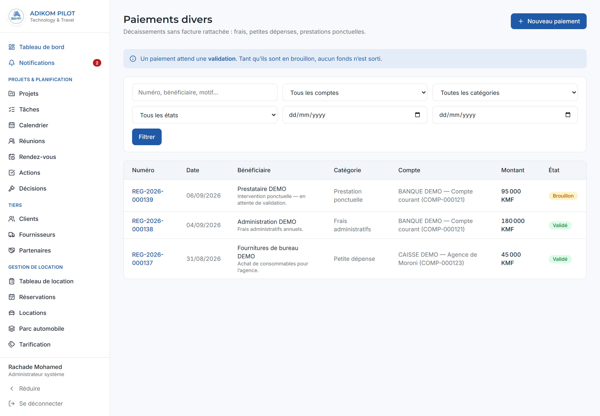

### Créer un paiement divers

| Champ | Obligatoire | Valeurs |
| --- | --- | --- |
| **Catégorie** | Oui | *Frais administratifs*, *Petite dépense*, *Prestation ponctuelle*, *Autre paiement autorisé* |
| **Bénéficiaire** | Oui | |
| **Compte source** | Oui | Débité à la validation |
| **Montant** | Oui | |
| **Date** | Oui | |
| **Motif** | Oui | |
| **Référence** | Non | |

### Les trois états

| État | Effet sur la trésorerie |
| --- | --- |
| **Brouillon** | **Aucun fonds sorti** : l'écriture naît à la validation |
| **Validé** | Le compte source est débité du montant payé |
| **Annulé** | L'écriture est annulée ; le solde du compte est revenu |

> Comme le virement interne, un paiement divers **se saisit puis se valide** —
> deux gestes, deux capacités. Les fonds ne bougent qu'à la validation.

## 10.6 Rapports fournisseurs

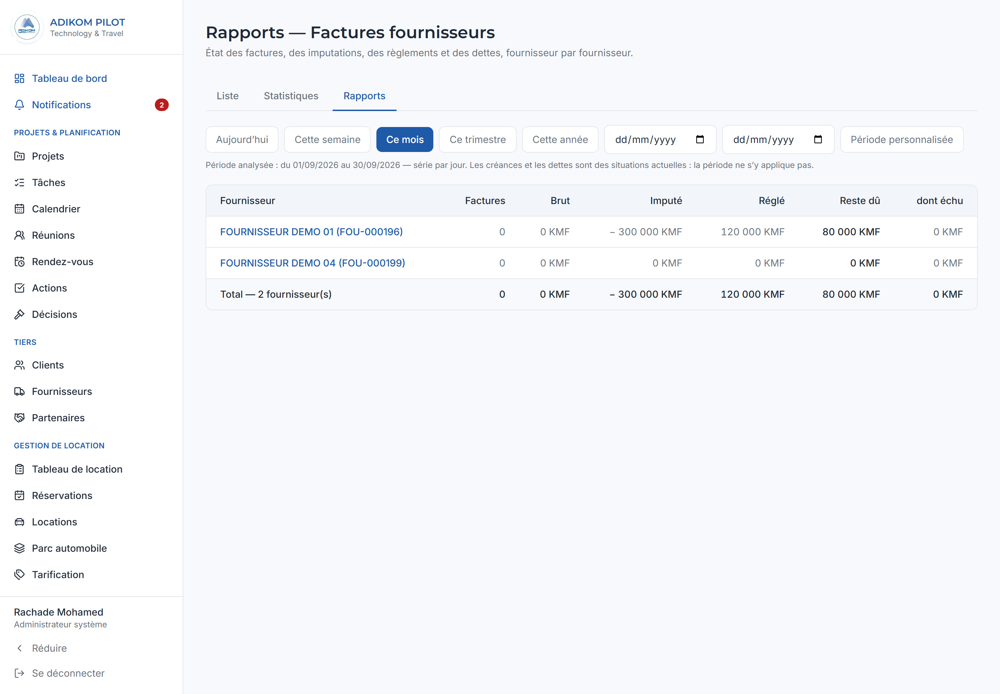

> **Ce qu'il faut observer** : la chaîne complète **brut → imputé → payé →
> reste dû**, par période et par fournisseur. C'est l'écran qui répond à la
> question « combien devons-nous, à qui, et pourquoi ? ».

## 10.7 Combien de gestes pour chaque opération ?

C'est une question fréquente. Le tableau ci-dessous la tranche.

| Opération | Nombre de gestes | Pourquoi |
| --- | --- | --- |
| Facture client | **Deux** : préparation puis émission | L'émission reconnaît une créance |
| Facture fournisseur | **Trois** : enregistrement, contrôle, validation | La validation reconnaît une dette |
| Règlement client | **Un** | Il constate un encaissement **déjà survenu** |
| Règlement fournisseur | **Un** | Même raison |
| Virement interne | **Deux** : saisie puis validation | Les fonds ne bougent qu'à la validation |
| Paiement divers | **Deux** : saisie puis validation | Même raison |
| Imputation | **Trois** : préparation, validation, rattachement | Seul le rattachement réduit une dette |

## 10.8 Erreurs et blocages possibles

| Ce que vous constatez | Explication |
| --- | --- |
| Impossible d'ajouter une imputation à une facture | La facture n'est pas **Validée** |
| Impossible d'enregistrer un règlement | La facture n'est pas émise (client) ou validée (fournisseur) |
| « Le montant dépasse le solde » | Un trop-perçu client est refusé (§13) |
| « Le montant dépasse le montant imputable » | Le plafond de la maintenance est atteint |
| Une facture émise ne se modifie plus | Elle est figée : annulez-la et refaites-la |
| Le net à payer n'a pas bougé après une imputation | L'imputation est *Validée* mais pas encore rattachée à une facture |
| Le solde du compte n'a pas bougé | Le virement ou le paiement divers est en **Brouillon** |

---

# 11 — Module 08 — Utilisateurs & Groupes

## 11.1 Objectif

Gérer les **comptes internes** d'ADIKOM, leurs **droits**, l'**organisation**
de l'entreprise et la **traçabilité** des actions.

## 11.2 Utilisateurs

### Où les trouver

Barre latérale → **UTILISATEURS & GROUPES** → **Utilisateurs**.

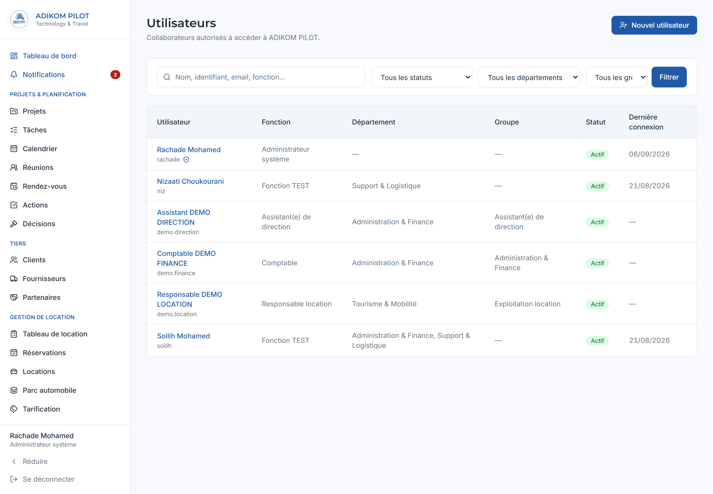

> **Ce qu'il faut observer** : chaque collaborateur avec son identifiant de
> connexion, sa fonction, ses groupes, son département et son statut.

### Créer un utilisateur

> **Seul le Super Admin crée des comptes.** C'est une règle absolue du système.

1. Cliquez sur **« Nouvel utilisateur »**.
2. Renseignez :

| Champ | Obligatoire | Précision |
| --- | --- | --- |
| **Prénom** et **Nom** | Oui | |
| **Identifiant de connexion** | Oui | Ce que la personne saisira pour se connecter |
| **E-mail** | Oui | |
| **Téléphone** | Non | |
| **Fonction** | Non | Son intitulé de poste |
| **Responsable hiérarchique** | Non | Alimente la vue hiérarchique |
| **Départements** | Non | Un ou plusieurs |
| **Groupes** | Non | **C'est ce qui porte ses droits** |
| **Mot de passe temporaire** | Oui | À remplacer par la personne à sa première connexion |

3. Enregistrez. Communiquez l'identifiant et le mot de passe temporaire à
   l'intéressé, par un canal sûr.

### Les quatre statuts d'un utilisateur

| Statut | Peut se connecter ? |
| --- | --- |
| **Actif** | Oui |
| **Inactif** | Non |
| **Suspendu** | Non |
| **Archivé** | Non |

> **Un utilisateur se désactive, il ne se supprime pas.** Son historique et ses
> actions journalisées doivent rester attribuables.

### La fiche d'un utilisateur

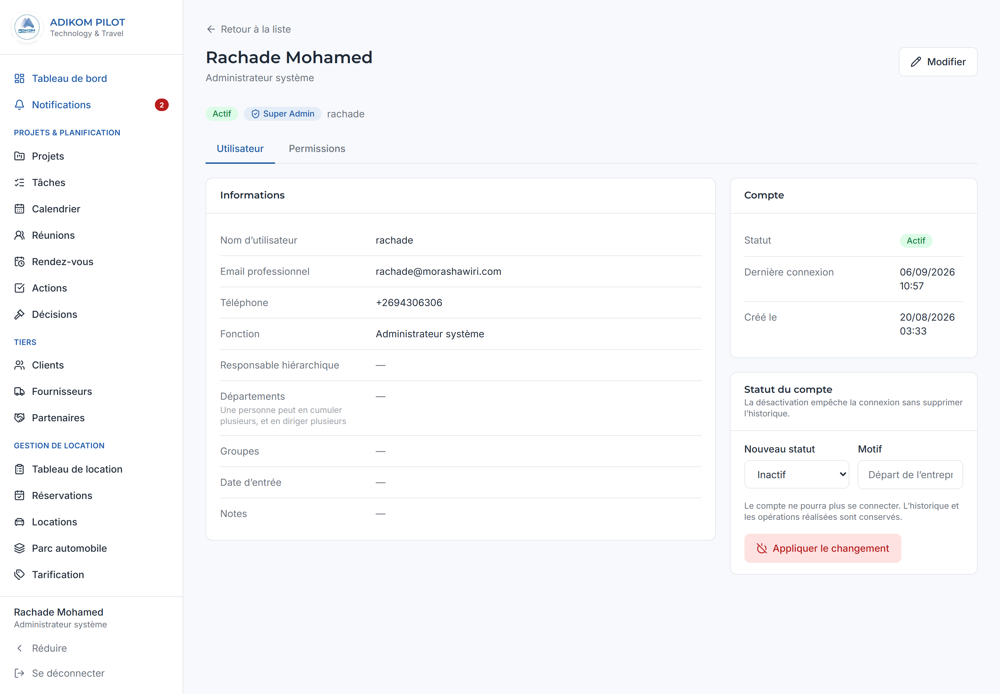

La fiche comporte **deux onglets** :

- **Utilisateur** — les informations relatives à l'employé.
- **Permissions** — l'arborescence complète de ses droits.

## 11.3 Permissions

### L'onglet Permissions

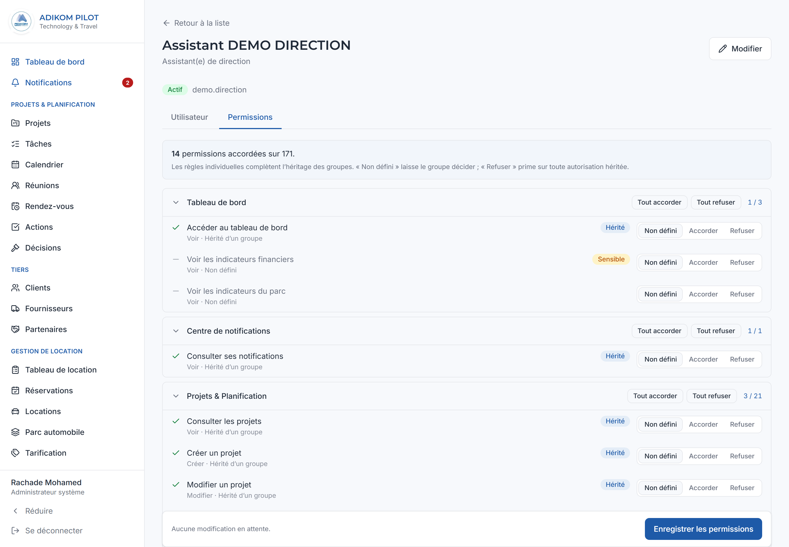

> **Ce qu'il faut observer sur cette capture**
>
> - En haut : **« 14 permissions accordées sur 171 »**, et la règle de lecture :
>   *« Les règles individuelles complètent l'héritage des groupes. "Non défini"
>   laisse le groupe décider ; "Refuser" prime sur toute autorisation
>   héritée. »*
> - L'arborescence **par module** : *Tableau de bord*, *Centre de
>   notifications*, *Projets & Planification*… avec un compteur à droite de
>   chaque module (`1 / 3`, `3 / 21`).
> - Pour chaque permission, **son libellé en français** (« Accéder au tableau de
>   bord »), **son action** (Voir, Créer, Modifier…) et **son origine**
>   (« Hérité d'un groupe », « Non défini »).
> - Un **badge « Hérité »** en bleu quand le droit vient d'un groupe.
> - Un **badge « Sensible »** en orange sur les permissions à fort enjeu — ici
>   *Voir les indicateurs financiers*.
> - **Trois boutons par ligne** : **Non défini** · **Accorder** · **Refuser**.
> - Des raccourcis par module : **« Tout accorder »** · **« Tout refuser »**.
> - En bas : **« Aucune modification en attente »** et le bouton
>   **« Enregistrer les permissions »**.

### La structure des droits

```
Utilisateur → Groupe → Module → Menu → Sous-menu → Action
```

Les actions possibles sont : **Voir**, **Créer**, **Modifier**, **Archiver**,
**Valider**, **Annuler**, **Exporter**, **Télécharger**, **Imprimer**,
**Administrer**.

### Les trois choix par permission

| Choix | Effet |
| --- | --- |
| **Non défini** | Laisse le groupe décider. C'est la valeur normale |
| **Accorder** | Accorde le droit individuellement, même si aucun groupe ne le porte |
| **Refuser** | Retire le droit **même si un groupe l'accorde**. Le refus prime toujours |

### Modifier les permissions d'un utilisateur

1. Ouvrez sa fiche, onglet **Permissions**.
2. Ajustez les lignes voulues.
3. Cliquez sur **« Enregistrer les permissions »**.

> **Trois garde-fous absolus :**
>
> 1. **Nul ne peut modifier ses propres permissions.** Le système refuse.
> 2. **Nul ne peut modifier les permissions du groupe dont il fait partie**, si
>    cela revient à s'accorder un droit.
> 3. **Toute modification est journalisée** — qui, quoi, quand, avant, après.

### Le Super Admin

Un compte Super Admin dispose de l'**accès complet aux 171 permissions**,
indépendamment de tout groupe. Son onglet Permissions l'annonce et n'offre aucun
réglage : ses droits ne dépendent d'aucune règle individuelle.

**Ses actions sont journalisées comme celles de tout le monde.**

## 11.4 Groupes

### Où les trouver

Barre latérale → **Groupes**.

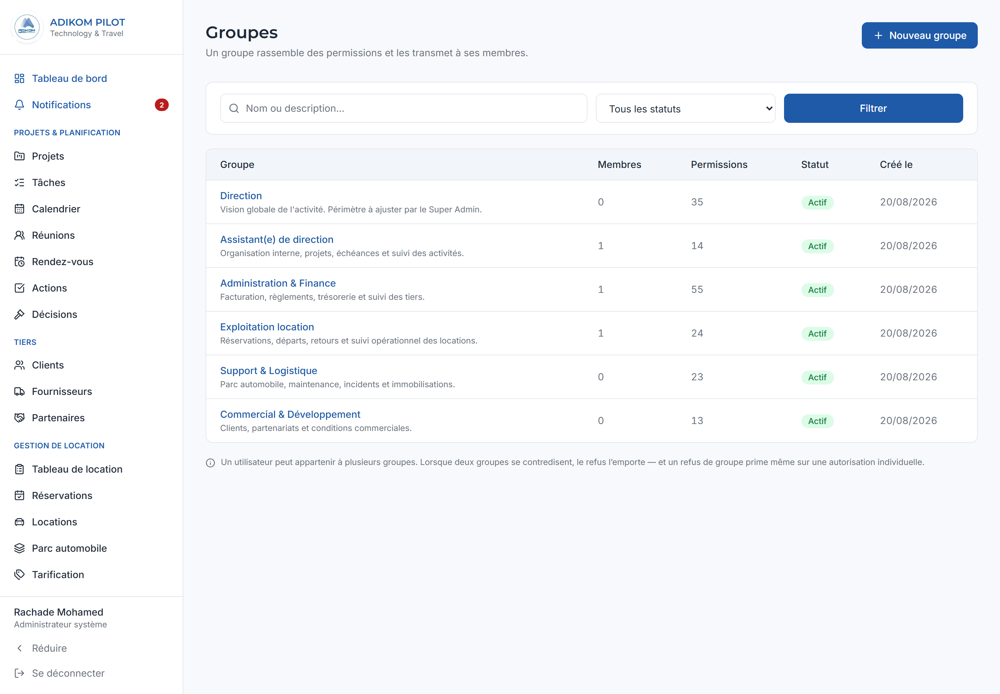

Un groupe est un **porteur de droits**. On l'attribue à plusieurs personnes qui
exercent le même métier.

### La fiche d'un groupe

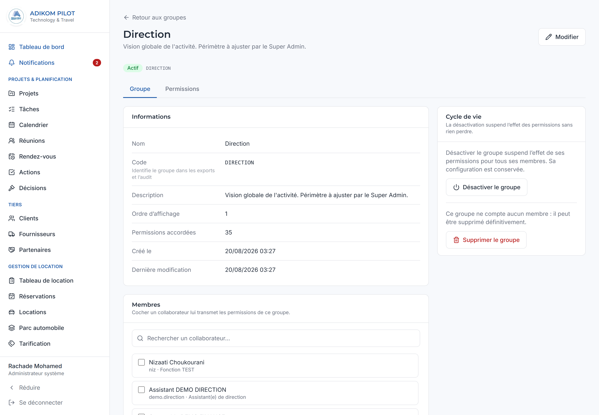

> **Ce qu'il faut observer** : les **membres** du groupe et l'arborescence de
> ses **permissions**, présentée comme celle d'un utilisateur.

### Marche à suivre recommandée

1. **Définissez les droits au niveau du groupe**, jamais utilisateur par
   utilisateur. C'est plus sûr et plus simple à maintenir.
2. **Réservez les règles individuelles aux exceptions** — une personne qui, pour
   une raison précise, doit avoir un droit de plus ou de moins que son groupe.

## 11.5 Vue hiérarchique

### Où la trouver

Barre latérale → **Vue hiérarchique**.

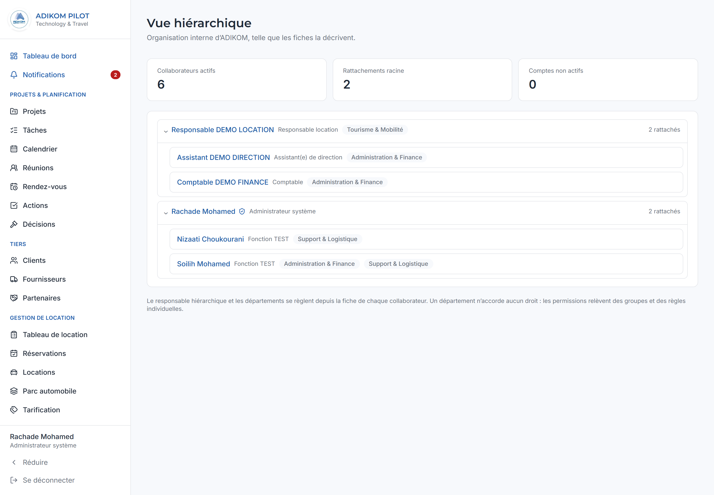

> **Ce qu'il faut observer sur cette capture**
>
> - Trois compteurs en haut : **Collaborateurs actifs**, **Rattachements
>   racine**, **Comptes non actifs**.
> - L'arborescence : chaque responsable, sa fonction, ses **départements** (en
>   petites étiquettes grises), et ses collaborateurs rattachés.
> - Le **bouclier** à côté d'un nom signale un **Super Admin**.
> - En bas, la précision essentielle : *« Le responsable hiérarchique et les
>   départements se règlent depuis la fiche de chaque collaborateur. **Un
>   département n'accorde aucun droit** : les permissions relèvent des groupes
>   et des règles individuelles. »*

> **Cette vue possède son propre droit**, indépendant de celui des utilisateurs.
> Une personne peut légitimement consulter l'organigramme sans avoir accès aux
> fiches individuelles.

## 11.6 Journal d'activité

### Objectif

Répondre à six questions : **qui**, **quoi**, **quand**, **sur quelle donnée**,
**avant**, **après**.

### Où le trouver

Barre latérale → **Journal d'activité**.

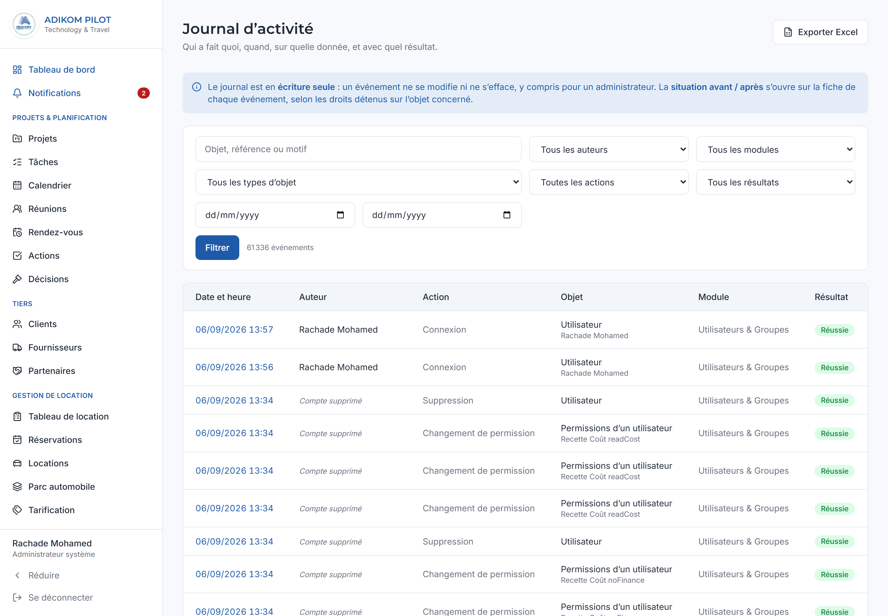

> **Ce qu'il faut observer sur cette capture**
>
> - Le bandeau bleu, qui pose la règle : *« Le journal est en **écriture
>   seule** : un événement ne se modifie ni ne s'efface, y compris pour un
>   administrateur. La **situation avant / après** s'ouvre sur la fiche de chaque
>   événement, selon les droits détenus sur l'objet concerné. »*
> - **Six filtres** : recherche libre, auteur, module, type d'objet, action,
>   résultat — plus deux **bornes de date**.
> - Le **nombre total d'événements** à côté du bouton *Filtrer*.
> - Les colonnes : **Date et heure**, **Auteur**, **Action**, **Objet**,
>   **Module**, **Résultat**.
> - Le badge de résultat : **Réussie** (vert), **Échec** (orange), **Refusée**
>   (rouge).
> - La mention *« Compte supprimé »* en italique pour un auteur qui n'existe
>   plus : **l'événement, lui, demeure**.
> - Le bouton **« Exporter Excel »**.

### Ce qui est journalisé

Dix-neuf types d'action : **Création**, **Modification**, **Suppression**,
**Archivage**, **Restauration**, **Validation**, **Annulation**, **Connexion**,
**Échec de connexion**, **Déconnexion**, **Paiement**, **Virement**,
**Imputation**, **Changement de permission**, **Changement de statut**,
**Changement de tarif**, **Changement de fournisseur**, **Export**, **Accès
refusé**.

> **Les refus sont journalisés au même titre que les réussites.** Une tentative
> d'accès refusée laisse une trace : c'est précisément ce qu'on veut pouvoir
> retrouver.

### La fiche d'un événement

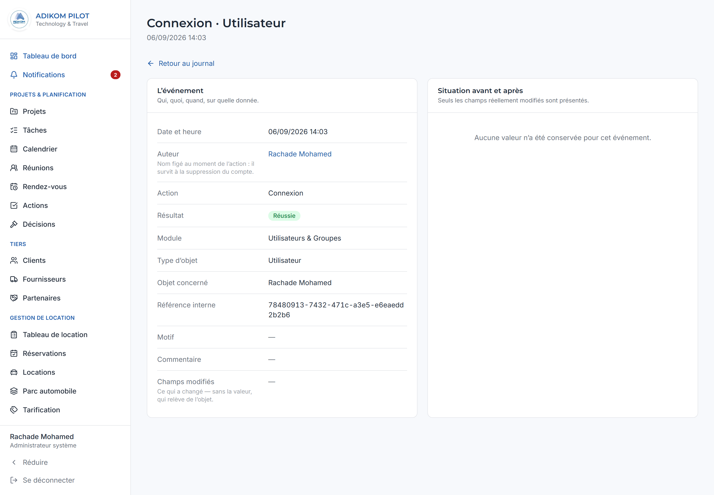

> **Ce qu'il faut observer** : l'événement complet — l'auteur, l'horodatage,
> l'objet, l'action, le résultat — et, lorsque vous y avez droit, la **situation
> avant et après**, champ par champ, avec les noms en français.

### Deux propriétés essentielles

> **1. Le journal ne se réécrit pas.** Aucune modification, aucune suppression,
> quel que soit le rôle. Même une réinitialisation complète du système le laisse
> intact : c'est lui qui en garde la trace.
>
> **2. Lire le journal n'ouvre pas le système.** Le droit de consulter le
> journal donne accès à l'**événement** — qui, quoi, quand, avec quel résultat.
> Il ne donne **pas** accès à la **donnée métier** : la situation avant/après
> reste derrière le droit de lecture de l'objet concerné.
>
> Sans cette distinction, une seule permission aurait rendu lisible
> l'intégralité du système.

## 11.7 Erreurs et blocages possibles

| Ce que vous constatez | Explication |
| --- | --- |
| Impossible de créer un utilisateur | Seul le Super Admin le peut |
| Impossible de modifier ses propres permissions | Refusé par principe |
| Un droit accordé individuellement reste inactif | Un groupe le **refuse** : le refus prime |
| Aucun bouton « Supprimer un utilisateur » | Un utilisateur se désactive (§3.3) |
| La situation avant/après est masquée dans le journal | Vous voyez l'événement, pas la donnée métier de l'objet |
| « Compte supprimé » comme auteur | Le compte n'existe plus ; l'événement demeure |

---

# 12 — Module 09 — Paramètres

## 12.1 Objectif

Définir **une fois** la configuration générale d'ADIKOM, reprise partout
ailleurs : sur les documents, dans les factures, dans les numéros de référence.

## 12.2 Où le trouver

Barre latérale → **Paramètres** (dernière entrée).

L'écran comporte **trois onglets** : **Entreprise**, **Numérotation**,
**Sauvegarde**.

## 12.3 Onglet Entreprise

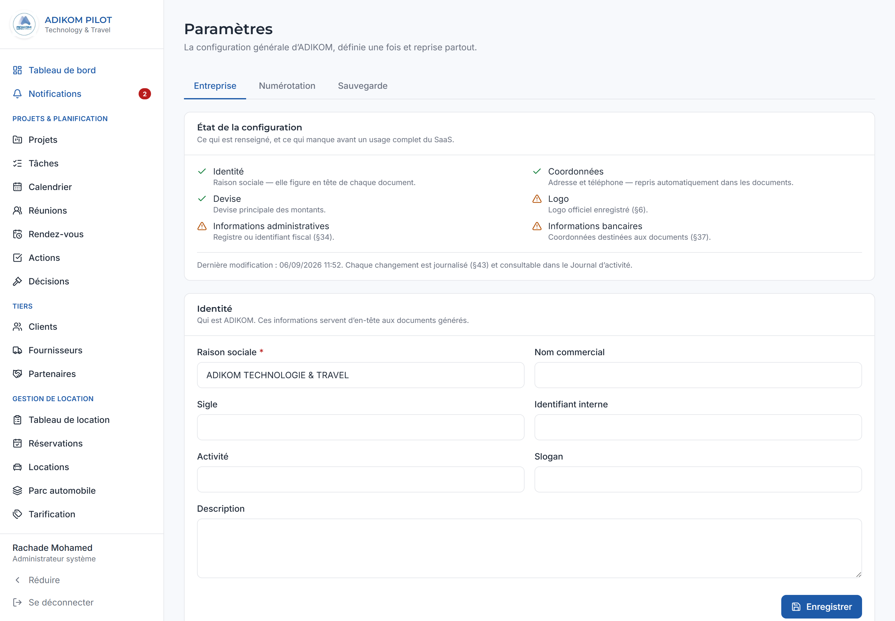

> **Ce qu'il faut observer** : la fiche découpée en **huit sections**, chacune
> avec son propre bouton de modification.

| Section | Contenu | Droit propre ? |
| --- | --- | --- |
| **Identité** | Qui est ADIKOM. Sert d'en-tête aux documents générés | Non |
| **Coordonnées** | Où joindre ADIKOM. Repris dans les documents | Non |
| **Administratif** | Registre, identifiants fiscaux, mentions légales | **Oui** |
| **Commercial** | Activités et description commerciale | Non |
| **Facturation** | Nom affiché, adresse et mentions sur une facture | Non |
| **Banque** | Coordonnées bancaires **destinées aux documents** | **Oui** |
| **Identité visuelle** | Logo et couleurs | **Oui** (modification) |
| **Préférences** | Devise, langue, fuseau horaire, format de date | Non |

> **Trois sections ont leur propre capacité** : *Administratif*, *Banque* et
> *Identité visuelle*. Un collaborateur chargé de mettre à jour l'adresse
> d'ADIKOM n'a aucune raison de lire ses coordonnées bancaires.
>
> Le contrôle est appliqué **colonne par colonne** dans la base. L'écran ne fait
> que le refléter — et il **le dit** lorsqu'une section reste fermée, plutôt que
> de la faire disparaître silencieusement.

> **Attention à ne pas confondre** : la section *Banque* contient les
> **coordonnées bancaires officielles imprimées sur les documents**. Les comptes
> **réellement mouvementés** relèvent du module **Banques & Caisses** (§9).

### Le logo

Formats acceptés : PNG, JPEG, WebP, SVG — **2 Mo maximum**.

> **Le logo officiel ADIKOM ne doit jamais être recréé, redessiné, recoloré,
> étiré ni approximé.** Utilisez toujours le fichier officiel fourni.

## 12.4 Onglet Numérotation

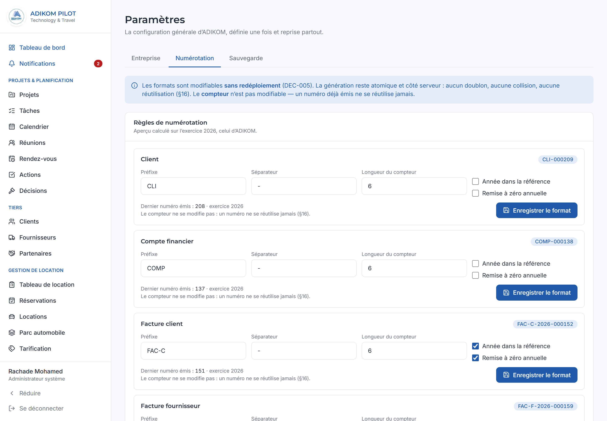

> **Ce qu'il faut observer** : pour chaque type de document, sa **règle** et un
> **aperçu du prochain numéro**.

Une règle se compose de :

| Élément | Exemple |
| --- | --- |
| **Préfixe** | `FAC-F` |
| **Inclure l'année** | Oui |
| **Séparateur** | `-` |
| **Nombre de chiffres** | 6 |
| **Remise à zéro annuelle** | Oui |

Ce qui produit : **`FAC-F-2026-000144`**.

> **Le compteur, lui, ne se modifie pas.** Vous pouvez changer le format à tout
> moment, sans redéploiement. Mais **un numéro déjà émis ne se réutilise
> jamais** : c'est une exigence comptable.

## 12.5 Onglet Sauvegarde

> **Cet onglet n'apparaît qu'au Super Admin.**

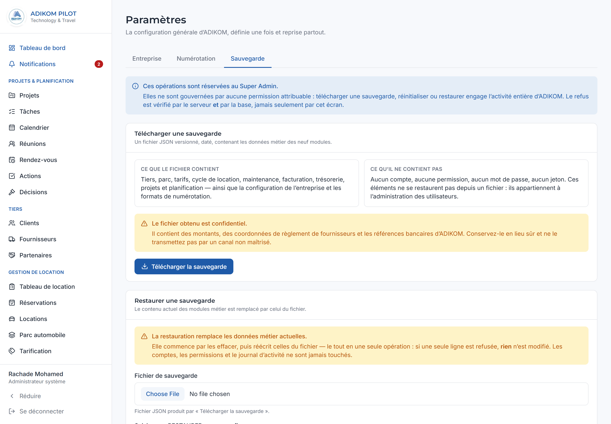

> **Ce qu'il faut observer sur cette capture**
>
> - Le bandeau bleu : *« Ces opérations sont réservées au Super Admin. Elles ne
>   sont gouvernées par **aucune permission attribuable** […]. Le refus est
>   vérifié par le serveur **et** par la base, jamais seulement par cet
>   écran. »*
> - **« Télécharger une sauvegarde »**, avec deux encadrés côte à côte :
>   **CE QUE LE FICHIER CONTIENT** (tiers, parc, tarifs, cycle de location,
>   maintenance, facturation, trésorerie, projets et planification, plus la
>   configuration de l'entreprise et les formats de numérotation) et **CE QU'IL
>   NE CONTIENT PAS** (aucun compte, aucune permission, aucun mot de passe,
>   aucun jeton).
> - Un avertissement jaune : *« Le fichier obtenu est confidentiel. Il contient
>   des montants, des coordonnées de règlement de fournisseurs et les références
>   bancaires d'ADIKOM. Conservez-le en lieu sûr et ne le transmettez pas par un
>   canal non maîtrisé. »*
> - **« Restaurer une sauvegarde »**, avec son propre avertissement : *« Elle
>   commence par les effacer, puis réécrit celles du fichier — le tout en une
>   seule opération : si une seule ligne est refusée, **rien** n'est modifié. Les
>   comptes, les permissions et le journal d'activité ne sont jamais touchés. »*
> - Le sélecteur de fichier et le champ de confirmation.

### Les trois opérations

#### A — Télécharger une sauvegarde

Cliquez sur **« Télécharger la sauvegarde »**. Vous obtenez un fichier nommé
`adikom-pilot-sauvegarde-AAAA-MM-JJ.json`.

> **Conseil : sauvegardez avant chaque opération sensible.** L'opération prend
> quelques secondes, et c'est le seul moyen de revenir en arrière.

#### B — Réinitialiser le système

Efface les **données métier** des neuf modules, en **une seule opération** : si
une partie échoue, **rien** n'est supprimé.

#### C — Restaurer une sauvegarde

Réécrit les données depuis un fichier, également en une seule opération.

### Ce qu'une réinitialisation efface, et ce qu'elle laisse

| Effacé | **Conservé** |
| --- | --- |
| Tiers, parc, tarifs | **Le compte Super Admin et sa connexion** |
| Réservations, locations, états des lieux | Tous les autres comptes et leurs droits |
| Incidents, maintenances, coûts | Groupes, départements, catalogue des permissions |
| Factures, imputations, règlements | Paramètres d'entreprise et numérotation |
| Comptes, écritures, virements, paiements | **Le journal d'activité** |
| Projets, tâches, réunions, décisions, actions | |

> **Le Super Admin n'est dans aucun périmètre.** Ce n'est pas une précaution
> d'exécution : les comptes, les groupes, les permissions et le journal
> **ne figurent pas dans la liste des données concernées**. Aucune des trois
> opérations ne lit, ne supprime ni n'écrit un compte. **Aucun fichier ne peut
> retirer au Super Admin sa capacité à se connecter.**

> **Les compteurs de numérotation ne reculent pas.** Un numéro déjà émis ne se
> réutilise jamais, même après une réinitialisation.

### Un fichier n'est jamais cru sur parole

Avant toute écriture, le système vérifie que le fichier est bien un JSON, que
son format est celui d'ADIKOM PILOT, que sa version est lisible, et que **chaque
section désigne une donnée autorisée**.

Un fichier contenant des comptes, des permissions ou le journal d'activité est
**refusé, avec son motif** — il n'est pas ignoré en silence.

Ensuite, les contrôles de cohérence s'appliquent tous : une écriture doit porter
le compte, le montant et le sens de l'opération dont elle se réclame ; un
virement validé porte exactement ses deux écritures ; une imputation ne dépasse
pas son plafond. **Un fichier incohérent échoue, et rien n'est modifié.**

## 12.6 Erreurs et blocages possibles

| Ce que vous constatez | Explication |
| --- | --- |
| L'onglet Sauvegarde est absent | Vous n'êtes pas Super Admin |
| Une section de la fiche entreprise est fermée | Elle relève d'une capacité que vous n'avez pas — l'écran le dit |
| Impossible de modifier le compteur de numérotation | C'est voulu : un numéro émis ne se réutilise pas |
| Une restauration a échoué | Le fichier a été refusé, avec son motif. **Rien n'a été modifié** |

---

# 13 — Ce que le système ne fait pas encore

Cette section est aussi importante que les précédentes. **Rien de ce qui suit
n'est un oubli** : chaque point a été volontairement écarté, faute d'une règle
métier arrêtée par ADIKOM. Les inventer aurait produit des chiffres faux.

## 13.1 Règles financières en attente de décision

| Sujet | Situation actuelle |
| --- | --- |
| **Arrondi de la durée facturable** | Le système ne calcule aucune durée facturable automatique |
| **Traitement du retard** | Le retard est **constaté**, jamais chiffré. Aucune pénalité |
| **Barèmes carburant, kilométrage, dommages** | Aucun écart n'est valorisé |
| **Caution et acompte** | Non gérés comme objets propres |
| **Découvert autorisé** | Aucun contrôle : un solde peut devenir négatif |
| **Régime de taxes** | Non appliqué |
| **Trop-perçu client** | Tout versement supérieur au solde est **refusé**, avec son motif |

## 13.2 Fonctionnalités écartées par décision

| Écarté | Raison |
| --- | --- |
| **Espace client / fournisseur** | Le système est strictement interne |
| **Sauvegarde automatique** | Suppose d'arrêter une fréquence, une rétention et un lieu de stockage |
| **Restauration partielle** | Suppose de décider du sort des données qui référencent ce qui n'est pas restauré |
| **Chiffrement du fichier de sauvegarde** | Aucune règle ne l'exige ; l'écran avertit de sa confidentialité |
| **Écriture de trésorerie libre** (dépôt, retrait, correction) | Figurent au vocabulaire ; aucun acte ne les produit |
| **Rapprochement bancaire, seuils d'alerte** | Rangés « futurs » par la documentation |
| **Sous-tâches et dépendances entre tâches** | La règle d'avancement reste à arrêter |
| **Documents de projet, commentaires** | Supposent leurs propres capacités et une durée de conservation |
| **Projet confidentiel** | Suppose de décider qui le déclare et qui l'ouvre malgré tout |
| **Historique des notifications** | Suppose de décider quels événements méritent une ligne, pour qui, et pour combien de temps |
| **Export des comptes et permissions** | Ne se restaure pas proprement : un compte vit aussi dans l'authentification |

## 13.3 Écrans annoncés mais non encore livrés

| Emplacement | Onglets « à venir » |
| --- | --- |
| Fiche client | Réservations · Locations · Documents · Historique |
| Fiche location | Historique |

Ces onglets sont affichés **inertes**. La fiche annonce ce qu'elle contiendra,
plutôt que de laisser croire à un écran en panne.

## 13.4 Gestion des partenariats

Le menu **Partenaires** livre le **répertoire**. La gestion du **partenariat**
lui-même — conditions, contrats, projets communs — reste à construire.

## 13.5 Capacités non créées

**Exporter, télécharger et imprimer les rapports, l'organigramme et les
groupes** supposent de créer les capacités correspondantes. Elles ne le sont pas
encore, donc ces boutons n'existent pas sur ces écrans.

---

# 14 — Scénarios complets

Cette section déroule les principaux parcours **de bout en bout**, sur les
données de démonstration présentes dans le système. C'est le meilleur moyen de
comprendre comment les modules s'articulent.

## 14.1 Le scénario central d'ADIKOM

**Véhicule fourni → panne → maintenance → coût → imputation → facture
fournisseur → paiement → trésorerie**

C'est le scénario qui a le plus structuré la conception du système.

### Étape 1 — Le véhicule est mis à disposition

**FOURNISSEUR DEMO 01** met **DEMO VEHICULE DEMO 02** à la disposition d'ADIKOM.

*Où le voir :* **Gestion de location → Parc automobile**


> Sur la deuxième ligne : *DEMO VEHICULE DEMO 02*, origine **« Fourni par un
> fournisseur »**, rattaché à **FOURNISSEUR DEMO 01 (FOU-000196)**.

### Étape 2 — Le véhicule tombe en panne

Un incident est constaté, puis une maintenance ouverte.

*Où le voir :* **Gestion de location → Maintenance**


> L'origine est **Panne**, la priorité **Urgente**. L'onglet **Coûts** porte le
> chiffrage de l'intervention.

### Étape 3 — Le coût est imputé au fournisseur

La réparation coûte **300 000 KMF**. Ce coût est imputé sur la facture du
fournisseur.

*Où le voir :* **Facturation & Paiement → Imputations**


> **Le point essentiel de tout le système** est écrit sur cet écran :
>
> *« Cette imputation est rattachée à une facture fournisseur : elle réduit le
> net à payer de cette facture. **Elle n'est pas un paiement** — aucun compte n'a
> été mouvementé. »*
>
> La **chaîne de traçabilité** relie l'imputation à sa maintenance
> (MNT-2026-000351), à son véhicule (DEMO 002) et à son fournisseur
> (FOURNISSEUR DEMO 01). Le **montant imputable** affiche son plafond :
> *300 000 KMF · 300 000 KMF imputés · 0 KMF disponibles*.

### Étape 4 — La facture fournisseur porte le calcul

*Où le voir :* **Facturation & Paiement → Factures fournisseurs**


> La ligne **FAC-F-2026-000144** montre les quatre grandeurs côte à côte :
> **500 000** brut · **300 000** imputés · **200 000** nets · **80 000** restant
> dus.


> Et la fiche les décompose, chacune avec son explication :
>
> ```
> Montant brut     500 000 KMF   Somme des lignes de la facture
> Total imputé     300 000 KMF   Imputations rattachées à cette facture
> Net à payer      200 000 KMF   Montant brut moins les imputations
> Total réglé      120 000 KMF   Règlements validés
> Reste dû          80 000 KMF   Net à payer moins les règlements validés
> ```
>
> Le bloc **« Imputations portées par cette facture »** — *« Pourquoi le montant
> dû a été réduit »* — cite l'imputation et son origine.

### Étape 5 — Le règlement mouvemente la trésorerie

Un acompte de **120 000 KMF** a été versé. Contrairement à l'imputation, **ce
règlement débite réellement un compte** et produit une écriture.

*Où le voir :* **Banques & Caisses → Écritures**


> L'écriture porte le compte, le sens (**Sortie**), le montant et l'opération
> qui l'a produite.

### Ce que le scénario démontre

| Grandeur | Montant | Nature |
| --- | --- | --- |
| Montant brut | 500 000 KMF | Ce que le fournisseur facture |
| Imputation | 300 000 KMF | **Une réduction. Pas un paiement.** Aucun compte mouvementé |
| Net à payer | 200 000 KMF | Ce qu'ADIKOM doit réellement |
| Règlement | 120 000 KMF | **Un paiement.** Un compte débité, une écriture produite |
| Reste dû | 80 000 KMF | Ce qu'il reste à payer |

> Un système qui confondrait imputation et paiement annoncerait une dette de
> **500 000 KMF** là où ADIKOM en doit **80 000**.

## 14.2 Le cycle complet d'une location

### Étape 1 — La réservation

**Gestion de location → Réservations → Nouvelle réservation**

Client, période, catégorie. La réservation naît en *Brouillon*.


> Le tarif n'est pas encore verrouillé : *« Aucun tarif n'est encore verrouillé :
> il le sera à la confirmation. »*

### Étape 2 — La confirmation

Choisissez le **véhicule à engager**, puis **« Confirmer la réservation »**.

**Deux choses se produisent :** le véhicule est engagé sur la période, et **le
tarif est verrouillé**.

### Étape 3 — Le départ

Enregistrez l'**état des lieux de départ** : kilométrage, carburant (en crans),
observations, photos.

La location passe **En cours**, le véhicule **En location**.


> Sur cette fiche : le **tarif verrouillé** (21 250 KMF / jour), son **origine**
> (*Remise accordée au client*), le **départ réel** (31/08/2026 08:15) et le lien
> vers la **réservation d'origine** — la chaîne est préservée.

### Étape 4 — Le suivi

Le **Tableau de location** montre à tout moment ce qui part, ce qui rentre et ce
qui est en retard.


> La section **En retard** signale ici LOC-2026-000267, dont le retour était
> attendu le 03/09/2026 à 18:00. *« Le retard est constaté ; aucun frais n'est
> calculé. »*

### Étape 5 — La prolongation (si nécessaire)

Panneau **« Prolonger »** : nouvelle date de retour et motif. Le véhicule reste
engagé sans interruption, **le tarif ne change pas**.

### Étape 6 — Le retour

**« Enregistrer le retour »** : état des lieux de retour, mêmes champs qu'au
départ. La location passe **Retournée**, puis **À contrôler**.

### Étape 7 — Le contrôle

Onglet **Contrôle** : les relevés de départ et de retour côte à côte. Validez.
La location passe **À facturer**.

### Étape 8 — La facturation

**Facturation & Paiement → Factures clients → Nouvelle facture**

Les lignes reprennent le **tarif verrouillé** du contrat. Émettez la facture.


### Étape 9 — Le règlement

Depuis la facture, enregistrez le règlement : montant, date, mode, compte
encaisseur. Une **écriture d'entrée** est produite.

### Étape 10 — La clôture

La location se clôture. Le dossier est complet et reste consultable.

## 14.3 Le virement interne

1. **Banques & Caisses → Virement interne → Nouveau virement**
2. Compte source, compte destination, montant, date, motif.
3. Le virement naît en **Brouillon**.


> *« **Aucun fonds déplacé** : les écritures naissent à la validation. »*
> Le bloc *Écritures produites* est vide.

4. **Validez.** Le système contrôle le solde, puis produit **deux écritures
   liées** : une sortie sur la source, une entrée sur la destination.

> **Jamais l'une sans l'autre.** Un virement à moitié écrit n'existe pas.

## 14.4 Le paiement divers

1. **Facturation & Paiement → Paiements divers → Nouveau paiement**
2. Catégorie, bénéficiaire, compte source, montant, motif.
3. **Brouillon** — aucun fonds sorti.
4. **Validez** — le compte est débité, l'écriture est produite.


## 14.5 Projet → tâche

1. **Projets & Planification → Projets → Nouveau projet**
   Nom, responsable, priorité, échéance.


2. **Tâches → Nouvelle tâche**, rattachée au projet.


3. L'**avancement du projet** se calcule automatiquement sur ses tâches.
4. Les **échéances** apparaissent sur le calendrier et alimentent le centre de
   notifications.


## 14.6 Réunion → décision → action

1. **Réunions → Nouvelle réunion** : objet, date, durée, participants, ordre du
   jour.


2. La réunion se tient. Passez-la **Tenue** et rédigez le **compte rendu**.


3. Consignez les **décisions** prises.


4. Créez les **actions** qui en découlent. **Chacune garde le lien vers son
   origine** — c'est ce qui la distingue d'une tâche.


5. Si une action réclame un suivi détaillé, **transformez-la en tâche**.
   L'action gèle alors son état et la tâche porte le suivi.

## 14.7 Attribuer des droits à un collaborateur

1. **Utilisateurs & Groupes → Groupes** : vérifiez qu'un groupe correspond au
   métier de la personne.


2. **Utilisateurs → Nouvel utilisateur** : créez le compte et rattachez-le au
   groupe. *(Super Admin uniquement.)*


3. Onglet **Permissions** : vérifiez ce que le groupe lui apporte. Ajustez
   uniquement les exceptions.


> Le compteur *« 14 permissions accordées sur 171 »* dit d'un coup d'œil
> l'étendue réelle des droits. Les badges **Hérité** montrent ce qui vient du
> groupe ; **Refuser** prime toujours sur une autorisation héritée.

4. **« Enregistrer les permissions »**. La modification est **journalisée**.

## 14.8 Retrouver qui a fait quoi

1. **Utilisateurs & Groupes → Journal d'activité**


2. Filtrez : par **auteur**, par **module**, par **type d'objet**, par
   **action**, par **résultat**, entre deux **dates**.
3. Ouvrez l'événement pour voir la **situation avant et après**.


> Le journal contient également les **refus** : une tentative d'accès refusée
> laisse une trace.

## 14.9 Sauvegarder avant une opération sensible

1. **Paramètres → Sauvegarde** *(Super Admin uniquement)*


2. **« Télécharger la sauvegarde »**. Vous obtenez
   `adikom-pilot-sauvegarde-AAAA-MM-JJ.json`.
3. Conservez le fichier **en lieu sûr** : il contient des montants et des
   coordonnées de règlement.
4. En cas de besoin, **« Restaurer une sauvegarde »** réécrit les données métier
   — en une seule opération, et **sans jamais toucher aux comptes, aux
   permissions ni au journal d'activité**.

---

# 15 — Vocabulaire des statuts

## Client

**Actif** · **Prospect** · **Inactif** · **Archivé**
*Seuls Actif et Prospect sont proposés pour une nouvelle opération.*

## Véhicule

**Disponible** · **Réservé** · **En location** · **En maintenance** ·
**Immobilisé** · **Indisponible** · **Retiré**

## Réservation

**Brouillon** · **En attente** · **Confirmée** · **En préparation** ·
**Convertie en location** · **Annulée** · **Expirée** *(calculé)*

## Location

**En préparation** · **Confirmée** · **En cours** · **Prolongée** ·
**En retard** *(calculé)* · **Retournée** · **À contrôler** · **À facturer** ·
**Facturée** · **Clôturée** · **Annulée**

## Incident

**Ouvert** · **En traitement** · **Clos** · **Annulé**

## Dommage — gravité

**Léger** · **Moyen** · **Important**

## Dommage — responsabilité

**Indéterminée** · **Client** · **ADIKOM** · **Fournisseur**

## Maintenance

**Brouillon** · **Planifiée** · **À diagnostiquer** · **En cours** ·
**En attente** · **Terminée** · **Annulée**

## Facture client

**Brouillon** · **Émise** · **Partiellement payée** *(calculé)* ·
**Payée** *(calculé)* · **En retard** *(calculé)* · **Annulée**

## Facture fournisseur

**Brouillon** · **En attente** · **Validée** · **Partiellement payée**
*(calculé)* · **Payée** *(calculé)* · **En retard** *(calculé)* · **Annulée**

## Imputation

**Brouillon** · **À valider** · **Validée** · **Imputée** · **Annulée**
*Seule « Imputée » réduit un montant dû.*

## Compte financier

**Actif** · **Inactif** · **Archivé**

## Écriture

**Validée** · **Annulée**

## Virement interne · Paiement divers

**Brouillon** · **Validé** · **Annulé**
*Les fonds ne bougent qu'à la validation.*

## Projet

**Brouillon** · **À venir** · **En cours** · **En pause** · **Terminé** ·
**Annulé**

## Tâche

**À faire** · **En cours** · **En attente** · **Terminée** · **Annulée**

## Réunion

**Planifiée** · **Tenue** · **Annulée**

## Rendez-vous

**Planifié** · **Honoré** · **Annulé**

## Action

**À faire** · **Terminée** · **Annulée**

## Utilisateur

**Actif** · **Inactif** · **Suspendu** · **Archivé**

---

# 16 — Blocages courants et que faire

## 16.1 « Je ne vois pas un menu »

Votre barre latérale n'affiche que ce que vous avez le droit de consulter. Un
menu fermé **disparaît**, il n'apparaît pas grisé.

**Que faire :** demandez à l'administrateur la capacité correspondante.

## 16.2 « Un bouton d'export / téléchargement / impression manque »

Ce sont **trois droits distincts**, séparés du droit de consulter (§3.2).

**Que faire :** demandez précisément lequel vous manque — *exporter*,
*télécharger* ou *imprimer*.

## 16.3 « Le système refuse mon action »

Cinq causes possibles, dans l'ordre de fréquence :

1. **L'état ne le permet pas.** Une facture brouillon ne se règle pas ; une
   maintenance en attente ne se termine pas.
2. **Une étape précédente manque.** Une location ne part pas sans réservation
   confirmée.
3. **Un plafond est atteint.** Une imputation ne dépasse pas le montant
   imputable de sa maintenance.
4. **Un conflit de calendrier.** Un véhicule est déjà engagé sur la période.
5. **Un droit manque.**

**Que faire :** lisez le message. Le système dit toujours **pourquoi** il
refuse.

## 16.4 « Un montant ne bouge pas »

| Symptôme | Cause probable |
| --- | --- |
| Le net à payer n'a pas baissé | L'imputation est *Validée* mais pas encore **rattachée** à une facture |
| Le solde du compte n'a pas bougé | Le virement ou le paiement divers est en **Brouillon** : il faut le **valider** |
| Le tarif n'a pas suivi la nouvelle grille | Il est **verrouillé** depuis la confirmation. C'est voulu |
| Une facture émise ne se corrige pas | Elle est figée : **annulez-la et refaites-la** |

## 16.5 « Je lis "non lisible" au lieu d'une valeur »

Ce n'est pas une panne. Le système vous dit qu'**il y a une donnée que vous
n'avez pas le droit de voir** — plutôt qu'un tiret qui laisserait croire qu'il
n'y a rien (§3.7).

## 16.6 « Je ne trouve pas le bouton Supprimer »

Il n'existe pas. Le système **archive** au lieu de supprimer (§3.3). L'historique
doit rester consultable.

## 16.7 « Le retard n'est pas facturé »

C'est volontaire. Le retard est **constaté** ; aucun frais n'est calculé, parce
que le barème correspondant n'a pas été arrêté par ADIKOM (§13.1).

## 16.8 « J'ai oublié mon mot de passe »

Contactez l'administrateur d'ADIKOM PILOT. Il vous attribuera un mot de passe
temporaire, que vous remplacerez à votre première connexion.

## 16.9 « J'ai fait une erreur »

Selon le cas :

| Situation | Marche à suivre |
| --- | --- |
| Une facture émise est fausse | **Annulez-la et refaites-la.** Elle ne se réécrit pas |
| Une imputation est rattachée à tort | **Détachez-la** de la facture, avec un motif. Le net à payer remonte |
| Un règlement est erroné | **Annulez-le.** L'écriture est annulée, le solde revient |
| Un virement est erroné | **Annulez-le.** Les deux écritures sont annulées |
| Une donnée métier est fausse | **Modifiez-la**, si son état le permet encore |

> **Dans tous les cas, rien n'est effacé.** Le journal d'activité conserve
> l'avant, l'après et l'auteur de chaque correction.

---

# En résumé

Trois idées à retenir de ce guide.

> **1. Vos droits vous suivent partout.** Ce que vous voyez, ce que vous pouvez
> faire et même ce dont vous êtes alerté dépendent des capacités qui vous ont
> été attribuées. Un écran qui semble incomplet est presque toujours un droit
> qui manque.
>
> **2. Une imputation n'est jamais un paiement.** C'est la règle financière
> centrale d'ADIKOM. Une imputation réduit ce qu'ADIKOM doit ; seul un règlement
> mouvemente un compte.
>
> **3. Rien ne se perd.** Le système archive plutôt que de supprimer, et le
> journal d'activité conserve qui a fait quoi, quand, et dans quel état la
> donnée se trouvait avant et après.

---

**ADIKOM PILOT**

*SaaS interne de gestion et de pilotage — ADIKOM TECHNOLOGIE & TRAVEL*

*Guide utilisateur — version 1.0 — 6 septembre 2026*
